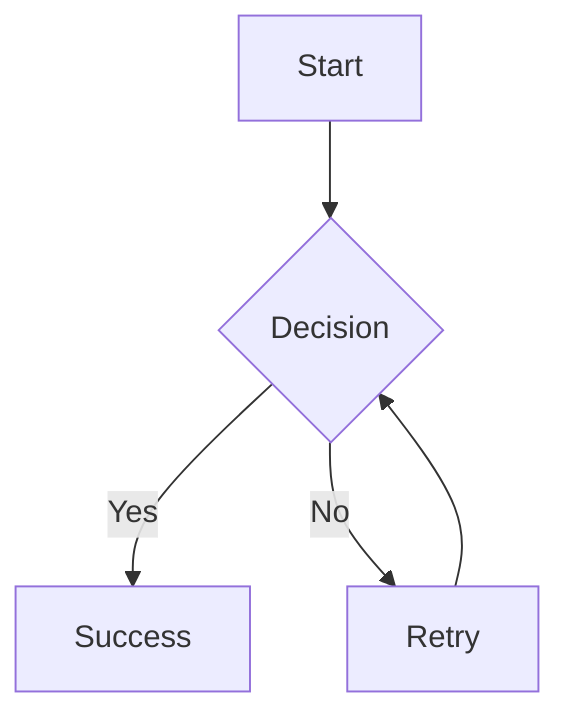
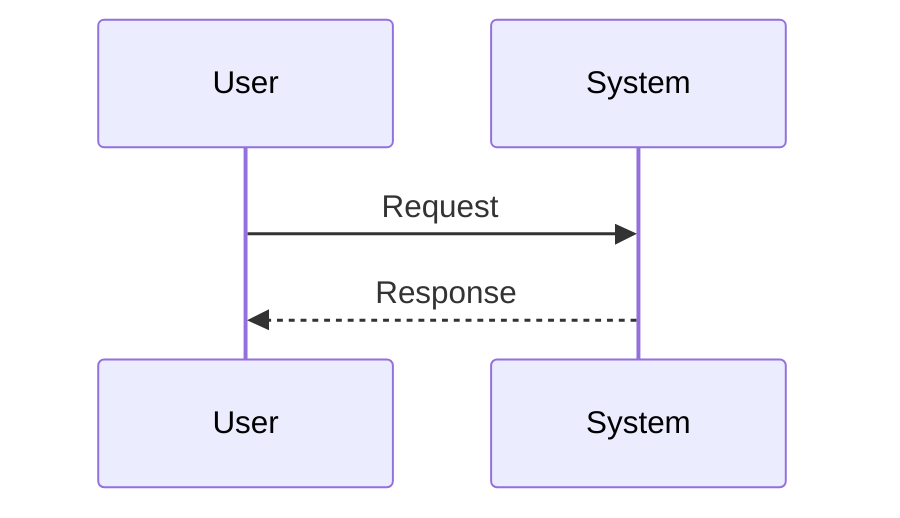

# Clawdbot Development Guide

This guide explains how to create new pages, projects, and reports in the Clawd Hub React SPA.

## 🚀 Quick Start Checklist

**Before doing anything:**
- [ ] `cd /Users/markdarby16/clawd/projects/clawd-hub/`
- [ ] `pwd` (verify: `/Users/markdarby16/clawd/projects/clawd-hub`)
- [ ] `git status` (verify: clawd-hub repo files shown)

**Make changes:**
- [ ] Edit/create files
- [ ] `git add -A`
- [ ] `git commit -m "feat: description"`
- [ ] `git push origin main`

## ⚠️ CRITICAL: Working Directory

**IMPORTANT: Always work from the clawd-hub project directory:**

```bash
# Correct working directory:
/Users/markdarby16/clawd/projects/clawd-hub/

# WRONG (parent directory - this causes git errors):
/Users/markdarby16/clawd/
```

**First command when starting work:**
```bash
cd /Users/markdarby16/clawd/projects/clawd-hub/
```

**Verify you're in the right place:**
```bash
pwd  # Should output: /Users/markdarby16/clawd/projects/clawd-hub
git status  # Should show clawd-hub repo status, NOT parent repo
ls  # Should show: src/, public/, node_modules/, package.json, etc.
```

## Git Workflow

**IMPORTANT: All git commands must be run from the clawd-hub directory:**

```bash
# 1. Navigate to project directory first
cd /Users/markdarby16/clawd/projects/clawd-hub/

# 2. Check status (ensure you see clawd-hub files, not parent)
git status

# 3. Add changes
git add -A

# 4. Commit
git commit -m "feat: add new page"

# 5. Push (this triggers GitHub Actions deployment)
git push origin main
```

**Error to avoid:** If you see warnings about "embedded git repository" or "submodule", you're in the wrong directory. Go back to step 1.

## 🔧 Troubleshooting

| Error Message | Cause | Solution |
|---------------|-------|----------|
| `warning: adding embedded git repository` | You're in the parent directory (`/Users/markdarby16/clawd/`) | Run `cd /Users/markdarby16/clawd/projects/clawd-hub/` then try again |
| `fatal: not a git repository` | You're not in a git directory | Run `cd /Users/markdarby16/clawd/projects/clawd-hub/` |
| `command not found: npm` | Not in the project directory | Run `cd /Users/markdarby16/clawd/projects/clawd-hub/` |
| `does not have a commit checked out` | Nested git repo inside clawd-hub | Remove the nested repo or add it as a submodule |

**Quick fix for most issues:**
```bash
cd /Users/markdarby16/clawd/projects/clawd-hub/
pwd  # Verify: /Users/markdarby16/clawd/projects/clawd-hub
git status  # Verify: Shows clawd-hub files
```

## 💡 Convenience Alias

Add this to your `~/.zshrc` for quick navigation:

```bash
# Add to ~/.zshrc
alias clawd-hub='cd /Users/markdarby16/clawd/projects/clawd-hub/'

# Then use it anytime:
clawd-hub
```

## Project Structure

```
src/
├── App.tsx                    # Main app with BrowserRouter and routes
├── components/
│   ├── Header.tsx            # Main header (dashboard only)
│   ├── NavSidebar.tsx        # Navigation sidebar (dashboard only)
│   ├── ProjectCard.tsx       # Project card component
│   └── ThemeSwitcher.tsx     # Theme/color mode switcher
├── pages/
│   └── flooring-basement.tsx # Example full-page route
├── lib/
│   ├── projects.ts           # Projects data array
│   └── themes.ts             # Theme management (4 color themes + light/dark)
└── components/ui/            # shadcn/ui components
```

## Architecture

- **Dashboard Layout** (`/`): Has Header, NavSidebar, Footer - used for main project browsing
- **Full-Page Routes** (e.g., `/flooring-basement`): Standalone pages with their own header/nav, no sidebar

## Creating a New Full Page (Report/Document)

### Step 1: Create the Page Component

Create a new file in `src/pages/` directory:

```tsx
// src/pages/my-new-page.tsx
import { ArrowLeft } from "lucide-react"
import { Link } from "react-router-dom"
import { ThemeSwitcher } from "../components/ThemeSwitcher"
import { getStoredColorMode, toggleColorMode, type ColorMode, type ThemeKey } from "@/lib/themes"
import { useState } from "react"

export default function MyNewPage() {
  const [currentTheme, setCurrentTheme] = useState<ThemeKey>("clawd")
  const currentMode = getStoredColorMode()

  const handleModeChange = (_mode: ColorMode) => {
    toggleColorMode()
  }

  return (
    <div className="min-h-screen flex flex-col bg-background">
      {/* Animated background mesh */}
      <div className="fixed inset-0 -z-10 opacity-10 pointer-events-none mesh-gradient"></div>

      {/* Navigation */}
      <nav className="flex-shrink-0 border-b bg-card/95 backdrop-blur supports-[backdrop-filter]:bg-card/60">
        <div className="container mx-auto px-4 sm:px-6 lg:px-8">
          <div className="flex h-16 items-center justify-between">
            <div className="flex items-center gap-4">
              <Link to="/" className="flex items-center gap-2 group">
                <div className="flex h-8 w-8 items-center justify-center rounded-lg bg-gradient-to-br text-primary-foreground transition-all duration-300 group-hover:scale-105 group-hover:rotate-12"
                  style={{ backgroundImage: `linear-gradient(to bottom right, var(--primary), var(--primary) / 0.6)` }}
                >
                  <span className="font-bold text-sm">C</span>
                </div>
                <div>
                  <div className="text-sm font-bold">Clawd Hub</div>
                  <div className="text-xs text-muted-foreground">AI-Powered Projects</div>
                </div>
              </Link>

              <Link to="/" className="inline-flex items-center gap-2 text-muted-foreground hover:text-foreground transition-all duration-200 hover:bg-muted px-3 py-2 rounded-lg text-sm font-medium">
                <ArrowLeft className="w-4 h-4" />
                Back to Hub
              </Link>
            </div>

            <div className="flex items-center gap-3">
              <ThemeSwitcher
                currentTheme={currentTheme}
                onThemeChange={setCurrentTheme}
                currentMode={currentMode}
                onModeChange={handleModeChange}
              />
            </div>
          </div>
        </div>
      </nav>

      {/* Hero Section (optional) */}
      <section className="relative py-16 sm:py-20 bg-card border-b border-border/50">
        <div className="container mx-auto px-4 sm:px-6 lg:px-8 text-center">
          <h1 className="text-4xl sm:text-5xl font-extrabold mb-4 tracking-tight bg-gradient-to-r from-primary via-purple-500 to-pink-500 bg-clip-text text-transparent">
            Page Title
          </h1>
          <p className="text-lg text-muted-foreground max-w-2xl mx-auto">
            Page description goes here
          </p>
        </div>
      </section>

      {/* Main Content */}
      <main className="flex-1 py-12">
        <div className="container mx-auto px-4 sm:px-6 lg:px-8">
          <div className="max-w-4xl mx-auto bg-card rounded-2xl border border-border/50 shadow-lg p-8 sm:p-12">
            {/* Your content here */}
          </div>
        </div>
      </main>

      {/* Footer */}
      <footer className="border-t border-border/50 bg-card py-6">
        <div className="container mx-auto px-4 text-center">
          <p className="text-sm text-muted-foreground">
            Generated by Clawdbot AI Assistant • {new Date().toLocaleDateString('en-US', { year: 'numeric', month: 'long', day: 'numeric' })}
          </p>
        </div>
      </footer>
    </div>
  )
}
```

### Step 2: Add Route in App.tsx

```tsx
// src/App.tsx
import MyNewPage from './pages/my-new-page'

// In the Routes component:
<Route path="/my-new-page" element={<MyNewPage />} />
```

### Step 3: Add to Projects List (Optional)

If the page should appear as a project card:

```tsx
// src/lib/projects.ts
export const projects: Project[] = [
  // ... existing projects
  {
    id: 'my-new-page',
    title: 'My New Page',
    description: 'Brief description of what this page contains...',
    category: 'home-renovation', // or 'ai-research'
    categoryLabel: 'Home Improvement',
    categoryIcon: '🏠',
    href: 'my-new-page',
    date: 'January 30, 2026',
    metadata: [
      {
        icon: 'M4 8V4m0 0h4M4 4l5 5m11-1V4m0 0h-4m4 0l-5 5M4 16v4m0 0h4m-4 0l5-5m11 5l-5-5m5 5v-4m0 4h-4',
        label: 'Some metric'
      }
    ]
  }
]
```

## Styling Guidelines

### CSS Variables for Colors
Always use CSS variables for theme compatibility:
- `--background`, `--foreground` - Main background/text
- `--primary` - Primary accent color (changes with theme)
- `--muted` - Muted backgrounds
- `--border` - Border colors
- `--card` - Card backgrounds

### Tailwind Classes
- Use `text-primary` for primary-colored text
- Use `bg-muted` for muted backgrounds
- Use `border-border` for borders
- Use `text-muted-foreground` for secondary text

### Custom Styles
For custom styles that need theme variables, use inline styles:
```tsx
const customBoxStyle = {
  background: "var(--muted)",
  borderLeft: "3px solid var(--primary)",
  padding: "20px",
  borderRadius: "8px",
}

// Usage:
<div style={customBoxStyle}>Content</div>
```

### Responsive Design
- Mobile-first approach
- Use container queries: `sm:px-6 lg:px-8`
- Text scaling: `text-4xl sm:text-5xl`

## Theme System

The app has 4 color themes × 2 modes = 8 total themes:

**Color Themes:**
- `clawd` (default)
- `ocean`
- `forest`
- `sunset`

**Modes:**
- `light`
- `dark`

Themes are stored in localStorage as:
- `clawd:theme` - color theme
- `clawd:colorMode` - light/dark mode

## Navigation Links

Use `Link` from `react-router-dom` for internal navigation:
```tsx
import { Link } from "react-router-dom"

<Link to="/">Back to Hub</Link>
```

## Build and Deploy

**ALWAYS start from the clawd-hub directory:**

```bash
# 1. Navigate to project directory
cd /Users/markdarby16/clawd/projects/clawd-hub/

# 2. Build (verifies code compiles)
npm run build

# 3. Preview locally (optional)
npm run preview

# 4. Deploy (git push triggers Render auto-deploy)
git add -A
git commit -m "feat: your message here"
git push origin main
```

**Deployment happens automatically via Render:**
- Render watches your GitHub repository
- On push to `main` branch, Render automatically:
  1. Runs `npm run build`
  2. Deploys the `dist/` folder
  3. Updates https://clawd-hub.onrender.com/

**If git commands fail with "embedded git repository" errors:**
1. You are in the wrong directory (probably `/Users/markdarby16/clawd/`)
2. Run: `cd /Users/markdarby16/clawd/projects/clawd-hub/`
3. Run: `git status` to verify
4. Try again

## Deployment Configuration

### Render Pages (Current)
- **Base URL**: `/` (root path)
- **BrowserRouter basename**: `/`
- **Deploy location**: https://stonebot.onrender.com/
- **Deployment**: Automatic on git push to main branch
- **Build Command**: `npm run build`
- **Publish Directory**: `dist/`

### GitHub Pages (Previous)
- **Base URL**: Was `/clawd/`
- **BrowserRouter basename**: Was `/clawd`
- **Note**: Migrated to Render Pages for simpler deployment (no subdirectory path handling needed)

### Why Render Pages?
- ✅ No subdirectory base path needed (root URL `/` works)
- ✅ Automatic deployments on git push
- ✅ No 404.html redirect workarounds needed for client-side routing
- ✅ Simpler configuration overall

## Common Patterns

### Highlight Box
```tsx
const highlightBoxStyle = {
  background: "var(--muted)",
  borderLeft: "3px solid var(--primary)",
  padding: "20px",
  borderRadius: "8px",
}
```

### Warning Box
```tsx
const warningBoxStyle = {
  background: "oklch(0.65 0.15 45 / 0.1)",
  borderLeft: "3px solid oklch(0.65 0.15 45)",
  padding: "16px",
  borderRadius: "8px",
}
```

### Calculation/Emphasis Box
```tsx
const calculationBoxStyle = {
  background: "linear-gradient(135deg, oklch(0.65 0.15 145 / 0.1) 0%, oklch(0.65 0.15 145 / 0.05) 100%)",
  border: "2px solid oklch(0.65 0.15 145 / 0.2)",
  padding: "32px",
  borderRadius: "16px",
  textAlign: "center" as const,
}
```

## File Naming Conventions

- Page components: `kebab-case.tsx` (e.g., `flooring-basement.tsx`)
- Route paths: match file names (e.g., `/flooring-basement`)
- Project IDs: use `kebab-case`

---

## 📝 Creating Pages with Markdown (Recommended for AI)

**NEW: You can now create pages using only Markdown files!** This is the easiest way for AI agents to generate content.

### ✅ Complete Checklist (Do All Steps)

When creating a new Markdown page, ensure you complete **ALL 4 steps**:

- [ ] **Step 1**: Create `.md` file (in `src/content/` or co-located in `src/pages/`)
- [ ] **Step 2**: Create `.tsx` page wrapper
- [ ] **Step 3**: Add route in `src/App.tsx`
- [ ] **Step 4**: Add to `src/lib/projects.ts` ← **This creates the dashboard card!**

### ⚠️ One-Time Setup (Already Done)

The following configurations are **already complete** in this project. You don't need to do these steps, but they're documented for reference.

#### 1. Vite Config (vite.config.ts)
```typescript
export default defineConfig({
  // ... existing config
  assetsInclude: ['**/*.md'],  // ← This tells Vite to handle .md files
})
```

#### 2. TypeScript Declarations (src/vite-env.d.ts)
```typescript
declare module '*.md' {
  const content: string
  export default content
}

declare module '*?raw' {
  const content: string
  export default content
}
```

**These are already configured!** You can proceed directly to creating pages.

### Why Use Markdown?

- ✅ **Simpler** — No React/JSX/TSX syntax to worry about
- ✅ **Faster** — Just write content, formatting is automatic
- ✅ **Fewer errors** — No complex component structure
- ✅ **AI-friendly** — Perfect for LLM content generation

### Quick Start: Create a Markdown Page

#### Step 1: Create the Markdown File

Create a file in `src/content/` with YAML frontmatter:

```markdown
---
title: "Your Page Title"
description: "A brief description of the page"
date: "2026-01-31"
category: "ai-research"
---

# Your Content Here

Write your content in **Markdown**. You can use:
- **Bold** and *italic* text
- Lists (ordered or unordered)
- [Links](https://example.com)
- `inline code`
- Code blocks
- Tables
- Blockquotes
- And more!

## Subsection Title

More content here...
```

#### Step 2: Create the Page Wrapper (1 File)

Create `src/pages/your-page.tsx`:

```tsx
import { MarkdownPageWithMeta } from '../components/MarkdownPage'
import content from '../content/your-page.md?raw'

export default function YourPage() {
  return <MarkdownPageWithMeta rawContent={content} />
}
```

#### Step 3: Add Route in App.tsx

```tsx
// src/App.tsx
import YourPage from './pages/your-page'

// Add to Routes:
<Route path="/your-page" element={<YourPage />} />
```

#### Step 4: Add to Projects List (IMPORTANT - Creates Dashboard Card)

**This step creates the card that appears on the main dashboard!** Without this, the page exists but won't be visible from the hub.

```tsx
// src/lib/projects.ts
{
  id: 'your-page',
  title: 'Your Page Title',
  description: 'Brief description from above...',
  category: 'ai-research', // or 'home-renovation', 'recipes', 'demo'
  categoryLabel: 'AI Research',
  categoryIcon: '🤖',
  href: '/your-page', // IMPORTANT: Absolute path, NO trailing slash!
  date: 'January 31, 2026',
  metadata: [
    { icon: '📝', label: 'Markdown powered' }
  ]
}
```

**⚠️ CRITICAL: href Format**
- Must use **absolute path** starting with `/`: `'/your-page'`
- Must **NOT** have trailing slash: `'/your-page/'` ❌
- Must match route path in `App.tsx` exactly
- Or use helper: `href: normalizeHref('your-page')`

### Markdown Features Supported

| Feature | Syntax |
|---------|--------|
| **Bold** | `**text**` |
| *Italic* | `*text*` |
| ~~Strikethrough~~ | `~~text~~` |
| `inline code` | `` `code` `` |
| Code blocks | ` ```language ... ``` ` |
| [Links](url) | `[text](url)` |
| Tables | ` \| column \| ... \| ` |
| Blockquotes | `> quote` |
| Lists | `- item` or `1. item` |
| **Mermaid Diagrams** | ` ```mermaid ... ``` ` |

### Mermaid Diagrams

**Mermaid.js is integrated for beautiful, responsive diagrams.**

**Supported diagram types:**
- Flowcharts: `graph TD` or `graph LR`
- Sequence diagrams: `sequenceDiagram`
- ER diagrams: `erDiagram`
- Gantt charts: `gantt`
- Mindmaps: `mindmap`
- Pie charts: `pie`
- And more...

**Example flowchart:**
````markdown

````

**Example sequence diagram:**
````markdown

````

**Themes:** Diagrams automatically adapt to light/dark mode.

**Demo:** See `/mermaid-demo` for live examples.

### Frontmatter Fields (Optional)

```yaml
---
title: "Page Title"           # Shown as H1
description: "Description"    # Shown as subtitle
date: "2026-01-31"           # Used in project card
category: "ai-research"       # For filtering
---
```

### Example: Full Markdown Page

See `src/content/markdown-demo.md` for a complete example.

### When to Use Each Approach

| Use Markdown When... | Use React/TSX When... |
|---------------------|----------------------|
| Creating articles, docs, reports | Building interactive UIs |
| AI generating content | Need complex state/interactivity |
| Simple page with text + images | Need custom animations/logic |
| Quick iteration on content | Need forms/user input |

### Migration: Convert Existing Page to Markdown

If you have an existing TSX page with mostly text content:

1. Copy the content to `src/content/your-page.md`
2. Add YAML frontmatter (title, description)
3. Create the simple wrapper as shown in Step 2
4. Update the route
5. Delete the old complex TSX file

### Alternative Pattern: Co-located Files (Simpler)

Instead of a separate `src/content/` folder, you can put the `.md` file right next to your `.tsx` page file:

```
src/pages/
├── your-page.tsx
└── your-page.md    ← Same directory!
```

**The page wrapper then uses a relative import:**

```tsx
// src/pages/your-page.tsx
import ReactMarkdown from 'react-markdown'
import remarkGfm from 'remark-gfm'
import content from './your-page.md'  // ← Same directory

export default function YourPage() {
  return (
    <div className="max-w-4xl mx-auto px-4 py-8">
      <div className="prose dark:prose-invert max-w-none">
        <ReactMarkdown remarkPlugins={[remarkGfm]}>
          {content}
        </ReactMarkdown>
      </div>
    </div>
  )
}
```

**When to use this pattern:**
- ✅ Quick/simple pages
- ✅ One-off content
- ✅ Don't need frontmatter parsing

**When to use `src/content/` + `MarkdownPageWithMeta`:**
- ✅ Want consistent page layout (header, back button, etc.)
- ✅ Multiple markdown pages
- ✅ Need frontmatter metadata

Both patterns work! Choose based on your needs.
