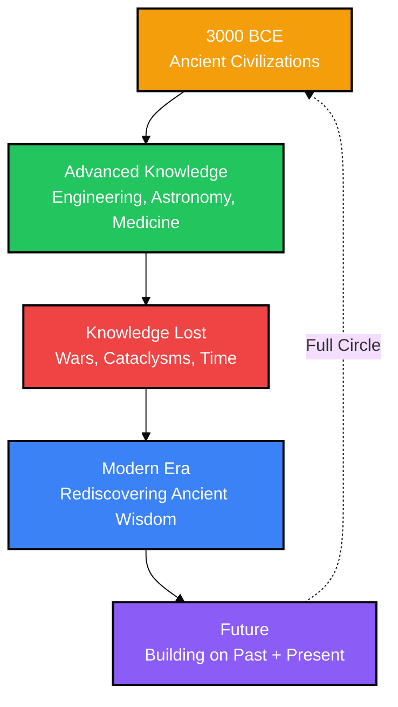

# Ancient Civilizations Had Advanced Knowledge We're Just Rediscovering

Every time we think we've reached the cutting edge of human knowledge, archaeology quietly taps us on the shoulder and says: "Actually, people thousands of years ago were already onto this."

From precision stonework that still baffles engineers to forgotten medical techniques now backed by modern research, the past is not nearly as primitive as many school textbooks made it seem. Instead of a straight line from ignorance to progress, history looks more like a **spiral**: ideas discovered, lost, and sometimes rediscovered in unexpected ways.

> [!TIP]
> **Key Insight:** Ancient civilizations had deep, practical knowledge that came from centuries of hands-on observation and experimentation — not primitive superstition.

---

## The Knowledge Spiral: A Conceptual Model

Modern culture often views history as a straight line of progress: from primitive to advanced. But evidence suggests a different pattern — a **spiral of knowledge**, where discoveries are made, lost, and rediscovered.

**The Pattern:**
1. **Discovery** — Ancient civilizations develop sophisticated techniques
2. **Loss** — Knowledge is lost through collapse, war, or neglect
3. **Rediscovery** — Modern science rediscovers what was once known
4. **Integration** — We combine ancient wisdom with modern technology

---

## 1. Precision Engineering: Stones That Defy Explanation

### The Evidence

Massive stone blocks at places like **Giza**, **Sacsayhuamán**, and **Baalbek** fit together so tightly that not even a sheet of paper slips through the joints. Some surfaces are astonishingly flat and true.

**Notable Sites:**

| Site | Location | Achievement |
|------|----------|-------------|
| **Great Pyramid of Giza** | Egypt | 2.3 million blocks, 2-ton average, precision to 0.05 inch |
| **Sacsayhuamán** | Peru | Interlocking stones, some weighing 200+ tons |
| **Baalbek** | Lebanon | Trilithon stones weighing 800+ tons |
| **Puma Punku** | Bolivia | H-shaped blocks with machine-cut precision |

### How They Did It

What's become clear is that these civilizations had an incredibly sophisticated understanding of:

- **Geometry** — Complex mathematical relationships in stonework
- **Load Distribution** — Weight management in massive structures
- **Material Behavior** — How stone expands, contracts, and endures
- **Seismic Engineering** — Buildings designed to survive earthquakes

> [!NOTE]
> Modern tools can reproduce this precision, but ancient builders achieved it through patient observation, empirical testing, and intergenerational knowledge transfer.

---

## 2. Acoustic Engineering: The Science of Sound

### Soundscapes of the Ancient World

Walk into certain ancient temples or tombs and your voice suddenly changes, echoing in strange ways or resonating at specific pitches. These aren't accidents — they're **deliberate design choices**.

**Examples:**

- **Mesoamerican ballcourts** — Whisper-carrying acoustics across vast spaces
- **Mediterranean domed chambers** — Focused echoes and resonance
- **Hypogeum in Malta** — Sound frequencies that alter consciousness (110 Hz)
- **Mayan temples** — Raindrop sound effects from handclaps

### The Physics They Understood

Ancient builders grasped concepts we now describe with wave physics:

- **Reflection** — Sound bouncing off surfaces
- **Interference** — Waves combining and canceling
- **Resonance** — Natural frequencies of spaces
- **Damping** — Absorbing unwanted sound

Think of it like a **stone guitar body** — carved not just for beauty but for tone.

> [!TIP]
> Modern concert halls use advanced software and simulations to chase similar results; ancient builders relied on trial, error, memory, and probably a very good ear. The underlying physics is the same — we just use different tools to talk about it.

---

## 3. Ancient Astronomy: Tracking the Cosmos

### Celestial Precision

Long before telescopes, ancient sky-watchers tracked the movements of the sun, moon, and planets with a level of dedication that's hard to imagine from our light-polluted world.

**Astronomical Achievements:**

| Site | Location | Alignment |
|------|----------|-----------|
| **Stonehenge** | England | Solstices, lunar standstills |
| **Nabta Playa** | Egypt | Summer solstice, precession |
| **Chichen Itza** | Mexico | Equinoxes, Venus cycles |
| **Angkor Wat** | Cambodia | Equinox sunrise alignment |

### The Knowledge Required

This tracking demanded:

- **Long-term observation** — Generations of sky-watching
- **Careful recordkeeping** — Preserving data across centuries
- **Mathematical models** — Predicting celestial events
- **Mental frameworks** — Understanding cosmic cycles

In some cases, ancient calendars captured astronomical cycles that modern scientists only formally described centuries or even millennia later.

---

## 4. Lost Medical Knowledge

### Rediscovering Ancient Remedies

Modern research is increasingly validating medical practices that were once dismissed as folk superstition:

**Validated Treatments:**
- **Willow bark** → Aspirin (pain relief)
- **Turmeric** → Anti-inflammatory properties
- **Honey** → Antibacterial wound care
- **Acupuncture** → Pain management
- **Fasting** -> Cellular autophagy and longevity

> [!WARNING]
> Not all ancient medicine was effective — but researchers are finding that many traditional remedies have a scientific basis we're only now understanding.

---

## What This Means for Us

### Lessons from the Past

**1. Respect Ancient Wisdom**
- "Primitive" doesn't mean "unintelligent"
- Different knowledge systems have different strengths
- Traditional knowledge often encodes empirical observations

**2. The Value of Deep Observation**
- Ancient peoples spent centuries observing natural phenomena
- Hands-on engagement yields insights theory alone cannot
- Patience and attention reveal patterns

**3. Knowledge is Fragile**
- Civilizations collapse, libraries burn, knowledge disappears
- What seems "obvious" today may be lost tomorrow
- Preserving knowledge matters

**4. Progress Isn't Linear**
- We don't simply move from "worse" to "better"
- Knowledge spirals — discovered, lost, rediscovered
- The past has as much to teach us as the future

---

## The Spiral Continues

As we uncover more about ancient civilizations, one theme emerges consistently: **human ingenuity is not a modern invention**. People thousands of years ago were just as curious, just as clever, and just as determined to understand their world.

The difference? They had **time** — centuries of it — and a deep, hands-on relationship with the natural world that modern life rarely allows.

Perhaps the real lesson isn't about ancient aliens or lost high technology. It's about the incredible capacity of human beings to observe, experiment, understand, and build — no matter when or where they live.

> [!QUOTE]
> *The past is not a primitive predecessor to our enlightened present. It is a different way of knowing, with its own strengths, insights, and achievements — some of which we are only now beginning to appreciate.*

---

## Further Exploration

**Related Topics:**
- Archaeoastronomy and ancient astronomy
- Acoustic properties of ancient spaces
- Traditional ecological knowledge
- Ethnobotany and traditional medicine

**Questions to Consider:**
- What "modern" knowledge might be rediscovered in 1,000 years?
- How can we better preserve knowledge across civilizational collapse?
- What ancient practices should we reintegrate into modern life?

---

*The spiral of knowledge continues. What will we rediscover next?*
