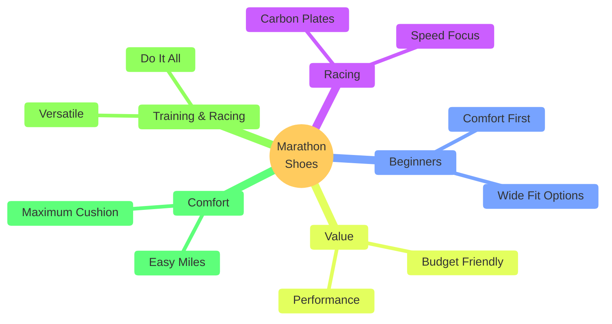

# Best Marathon Running Shoes 2026 - Complete Guide

A comprehensive breakdown of the best marathon running shoes across 5 key categories: Carbon Plate Racing, Beginners, Value, Training & Racing, and Comfort. Based on expert testing and voting by the Run Testers team.

> [!TIP]
> **Spring Marathon Season:** It's February 2026, and spring marathon season is approaching. This guide covers the best shoes for your training block and race day, whether you're aiming for a PB or just getting to the finish line comfortably.

---

## Categories Overview

---

## 1. Best Carbon Plate Racing Shoes

### 🏆 Winner: ASICS Meta Speed Tokyo Series

The **ASICS Meta Speed Sky Tokyo** and **ASICS Meta Speed Edge Tokyo** are the clear winners for carbon plate racing shoes.

**What Makes Them Special:**
- **Phenomenally lightweight** — Among the lightest carbon shoes on the market
- **Dual density midsole** — FFA foam (soft/bouncy) + FF Turbo foam (firm/lightweight)
- **Team divided** — Votes split evenly between Sky and Edge

**Sky vs Edge:**

| Feature | Sky Tokyo | Edge Tokyo |
|---------|-----------|------------|
| **Plate Position** | Higher in foam | Lower/scooped in foam |
| **Foam Order** | FF Turbo on bottom | FF Turbo on top |
| **Preference** | Faster feel | More stable |
| **Best For** | Speed-focused runners | Stability-focused runners |

**Why They Won:**
- All-round racing package that works for wide variety of runners
- Stand out even in crowded market of excellent racing shoes
- Proven performance at marathon distance

### 🥈 Runner Up: Puma Fast-R Nitro Elite 3

**Key Features:**
- **Unbelievably efficient** — Research shows more efficient than many racers
- **Aggressive rockered ride** — Carbon plate extends beyond front of foot
- **Holds up over marathon distance** — Even when form breaks down in second half
- **Extremely lightweight** — Minimal weight penalty

**Trade-offs:**
- Not as cushioned/comfortable as some carbon racers
- Expensive (but no carbon shoes are cheap)

> [!NOTE]
> **Value Tip:** Consider last year's carbon racing shoes — still incredibly good and often significantly cheaper than current models.

### Other Excellent Options

- ASICS Meta Speed Ray
- Hoka Carbon X 3.0
- Saucony Endorphin Elite
- Nike AlphaFly 3
- Adidas Adizero Adios Pro 4

---

## 2. Best for Beginner Marathoners

### 🏆 Winner: New Balance 1080 v15

The **New Balance 1080 v15** is the top pick for first-time marathoners.

**Why It's Perfect for Beginners:**

| Feature | Benefit |
|---------|---------|
| **Accommodating fit** | Available in wide and extra-wide widths |
| **Surprisingly lightweight** | Not heavy despite max cushion |
| **New midsole foam** | Comfortable but feels lively and responsive |
| **Comfortable upper** | Good padding in tongue and collar |
| **Durable outsole** | Rubber in key wear areas, lasts full training block |
| **Versatile** | Handles easy runs and faster sessions smoothly |

**What It Does Best:**
- Primarily built for comfortable easy miles
- Absolutely capable of handling faster work
- Smooth and stable when you pick up the pace
- Gets you to the starting line and through 26.2 miles

### Honorable Mentions

**Nike Vomero 18 & Vomero Plus:**
- Plenty of bouncy ZoomX foam
- Great for mixing up paces
- Solid outsoles and comfortable uppers
- Vomero Plus has more ZoomX for extra spring

**ASICS Novablast 5:**
- Cheaper than 1080 v15
- Comfortable, versatile ride
- Slightly more rockered than 1080

**Decathlon Kiprun Kipride Max:**
- Max cushioned with plenty of bounce and spring
- Some scope for faster paces
- Great value option

---

## 3. Best Value Marathon Shoes

### 🏆 Winner: Adidas Adizero SL

**Why It's the Value King:**

The **Adizero SL** costs far less than expected for a shoe at this performance level.

**Performance Features:**
- **LightStrike Pro foam** — Really bouncy, very efficient feel
- **Feels light on foot** — Despite substantial cushion
- **Versatile** — Great for daily training, speed work, AND race day
- **Marathon-capable** — Has the performance benefits of race day shoes

**Value Proposition:**
- Out for over a year — available considerably cheaper than RRP
- Does almost everything you want for marathon racing
- Still works great for training

**The Trade-off:**
- ⚠️ **Lacks stability** — If you need stability support, this isn't your shoe

### 🥈 Runner Up: Puma Velocity Nitro 4

**Even better value:**
- Cheaper than Adizero SL
- Very balanced shoe
- **More stability** than Adizero SL
- Delivers for pretty much anyone seeking solid all-round performance
- No plate, no crazy bounce — but versatile and capable

**Outstanding Feature:**
- **Fantastic outsole** — Far better than Adizero SL
- Puma Grip is one of the best road shoe grips available
- Significant discounts available (been out a while)

---

## 4. Best for Training AND Racing (Do-It-All Shoes)

### 🏆 Winner: ASICS Novablast 3 (Mega Blast)

The **ASICS Novablast 3** (Mega Blast) takes some beating as a do-it-all shoe.

**What It Does:**
- Excels at the majority of your runs
- Has a **marathon pace sweet spot**
- Great for: speed sessions, long tempos, recovery runs, progression work
- Enough cushion for 26.2-mile road protection
- Light and punchy enough to pick up the pace

**The Mega Reality:**
- ⚠️ **Eye-watering price tag** — But delivers across the board
- Not as stiff/snappy as full carbon plate shoes
- More of a "hedge your bets" race day option
- Perfect for 4-6 hour marathoners wanting guaranteed comfort

**Who It's For:**
- Runners who want ONE shoe for everything
- Those who prioritize comfort over max speed
- Marathoners who want insurance against foot fatigue

### Honorable Mentions

**Hoka Mach X3:**
- More comfort than Mach X2
- Improved fit, softer edges
- Traded some weight for better long-mileage comfort
- Heavier, so not as all-out racy
- High stack of dual-density foam (PEBA top layer + Pebax plate)
- Broader training appeal, still goes on race day

**Saucony Endorphin Speed 5:**
- Genuine allrounder
- Lively cushioned ride, light and full of energy
- Enough for chasing fast marathon times
- Streamlined, agile
- Pairs easy comfort with propulsive ride
- Full-length nylon plate (SPEEDROLL technology)
- Snappy, rocket energy — smooth and punchy

**Adidas Adizero SL:**
- (Also appears in Value category)
- Fun, bouncy ride with marathon racing punch
- Practical for daily training
- Springy LightStrike Pro foam
- Fast without plate propulsion
- Soft enough for easy runs
- Extra protection when marathon gets heavy

---

## 5. Most Comfortable Marathon Shoes

### 🏆 Winner: Nike Vomero Plus

The **Nike Vomero Plus** is the top comfort pick (with Vomero Premium as the ultra-luxury option).

**Vomero Plus vs Vomero Premium:**

| Feature | Vomero Plus | Vomero Premium |
|---------|-------------|----------------|
| **Stack Height** | 45mm heel / 35mm forefoot | 55mm heel (crazy high!) |
| **Price** | Normal cushion shoe price | Very expensive |
| **Weight** | Normal, manageable | Heavy, sluggish |
| **Comfort** | Exceptional | Maximum |
| **Recommendation** | ✅ Most people | Luxury option only |

**Why Vomero Plus Won:**
- **Very high stack of ZoomX foam** — Springy, soft, bouncy
- Turns over quite quickly despite max cushion
- Bounces you on your way — nice turnover for easy marathon pace
- Comfortable upper, solid outsole (lasts lots of miles)
- Not just cushioning — gives energy back

**The Philosophy:**
You have to run 26.2 miles. Even taking it easy, you need to get through the miles. Nice to have a shoe that's not just about cushioning impact, but also gives bounce back to keep you turning over smoothly.

### Honorable Mentions

**Decathlon Kiprun Kipride Max:**
- Generously stacked cushion shoe
- Very comfortable with nice rebound
- Turns feet over well
- Not heavy
- Great value, especially in UK

**New Balance 1080 v15:**
- Great for beginners
- Nice comfortable ride
- Surprisingly lightweight for such a cushion shoe

**Saucony Hurricane 25:**
- For those who want **stability + comfort**
- Maxed-out cushion with easy rocker
- Blend of two foams creates stability:
  - Firmer frame for stability
  - Power Run PB core for bounce in middle
- Designed purely for comfort
- Nice fluid ride for training and race day

---

## Quick Reference Guide

### By Marathon Goal Time

| Goal Time | Racing Shoe | Training Shoe |
|-----------|-------------|---------------|
| **Sub-3:00** | ASICS Tokyo, Puma Fast-R | ASICS Mega Blast, Hoka Mach X3 |
| **3:00-4:00** | Any carbon racer | Novablast 3, Endorphin Speed 5 |
| **4:00-5:00** | Adizero SL | 1080 v15, Vomero Plus |
| **5:00+** | Vomero Plus, Adizero SL | 1080 v15, Hurricane 25 |

### By Budget

| Budget | Racing Option | Training Option |
|--------|---------------|-----------------|
| **Under $150** | Last year's carbon racers | Decathlon Kipride Max |
| **$150-$200** | Puma Fast-R, Adizero SL | ASICS Novablast 5 |
| **$200+** | ASICS Tokyo series | Mega Blast, Hoka Mach X3 |

### By Priority

| Your Priority | Top Pick |
|---------------|----------|
| **Pure Speed** | ASICS Meta Speed Sky Tokyo |
| **First Marathon** | New Balance 1080 v15 |
| **Best Value** | Adidas Adizero SL |
| **One-Shoe Quiver** | ASICS Novablast 3 (Mega Blast) |
| **Maximum Comfort** | Nike Vomero Plus |
| **Stability Needed** | Saucony Hurricane 25 |

---

## Key Takeaways

> [!TIP]
> **You can't really go wrong** — Every major brand has excellent options in 2026. The key is matching the shoe to YOUR priorities: speed, comfort, value, or versatility.

**Critical Insights:**

1. **Carbon racers are worth it** if you're chasing a PB
2. **Beginners need comfort and durability** — 1080 v15 is perfect
3. **Value champions** — Adizero SL and Puma Velocity Nitro 4 deliver race-day performance for training-shoe prices
4. **Do-it-all shoes exist** — Mega Blast, Mach X3, Endorphin Speed 5 can handle your whole training block AND race day
5. **Comfort doesn't mean slow** — Vomero Plus's ZoomX foam gives energy back, not just cushioning

**Final Advice:**
- Don't overthink it — all shoes mentioned here are excellent
- Consider last year's models for better value
- Think about your goal time and priorities
- If in doubt, you can buy ONE shoe (like Adizero SL or Mega Blast) and do everything in it

---

*Based on Run Testers video "Best Marathon Running Shoes 2026" • Video ID: w1PFYzN_P3Y • Duration: 15:44 • February 2026*

**Source:** [Run Testers YouTube Channel](https://www.youtube.com/watch?v=w1PFYzN_P3Y)
