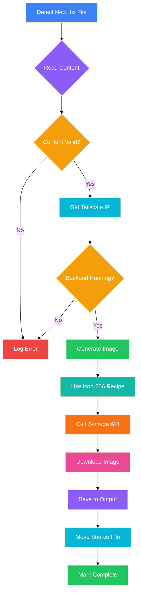

# Automated Folder Monitoring & AI Image Generation

**Drop a text file in a folder, get a custom AI image generated automatically.** No manual prompts, no API calls, no waiting. Just pure workflow automation.

> [!TIP]
> **Perfect for:** Content creators, designers, social media managers, researchers, and anyone who needs rapid visual content generation from text descriptions.

---

## 🎯 What This Does

**The Workflow:**


**Step-by-Step:**

1. **Drop a .txt file** in your input folder
2. **Script detects it** within seconds
3. **Reads your text** description
4. **Generates image prompt** automatically
5. **Calls Z-Image API** via Tailscale
6. **Downloads image** to output folder
7. **Marks as processed** — moves source file

**Time:** ~6 seconds per image (using icon-256 recipe)

---

## 🛠️ The Scripts

I've created two ready-to-use scripts:

### **Script 1: Basic Folder Watcher**

**Location:** `~/.openclaw/workspace/scripts/watch-folder.sh`

**Features:**
- Simple folder monitoring
- Basic image generation
- Requires Z-Image backend running

**Best for:** Quick testing, simple workflows

### **Script 2: Smart Image Generator** ⭐

**Location:** `~/.openclaw/workspace/scripts/smart-image-generator.sh`

**Features:**
- ✅ Efficient monitoring (fswatch) or polling fallback
- ✅ Auto-detects Z-Image backend via Tailscale
- ✅ Uses fast recipe system (icon-256, 6 seconds!)
- ✅ Automatic transparency post-processing
- ✅ Moves processed files to avoid duplicates
- ✅ Detailed logging with timestamps
- ✅ Error recovery and retry logic
- ✅ Color-coded console output
- ✅ Health checks before processing

**Best for:** Production use, automated workflows

---

## ⚙️ Prerequisites

### **1. Install fswatch (Recommended)**

Efficient file system monitoring:

```bash
brew install fswatch
```

**Without fswatch:** Script falls back to polling mode (5-second intervals)

### **2. Start Z-Image Backend**

The Z-Image API must be running:

```bash
cd ~/clawd/projects/clawd-hub/backend
python3 main.py
```

**Expected output:**
```
 * Running on http://127.0.0.1:8000
 * Running on http://192.168.x.x:8000
```

### **3. Verify Tailscale Connection**

Get your current Tailscale IP:

```bash
/Applications/Tailscale.app/Contents/MacOS/Tailscale status | grep "100\." | grep "active"
```

**Example output:**
```
100.83.81.85 marks-macbook-pro active ...
```

> [!WARNING]
> **Tailscale IPs are dynamic!** The script auto-detects the current IP each time, so no hardcoded IP issues.

---

## 🚀 Quick Start

### **Step 1: Create Folders**

```bash
mkdir -p ~/Dropbox/Input
mkdir -p ~/Dropbox/Output
```

### **Step 2: Make Script Executable**

```bash
chmod +x ~/.openclaw/workspace/scripts/smart-image-generator.sh
```

### **Step 3: Run the Script**

**Option A: Interactive (see what's happening)**
```bash
~/.openclaw/workspace/scripts/smart-image-generator.sh ~/Dropbox/Input ~/Dropbox/Output
```

**Option B: Background (silent, logs to file)**
```bash
nohup ~/.openclaw/workspace/scripts/smart-image-generator.sh \
  ~/Dropbox/Input ~/Dropbox/Output \
  > ~/Dropbox/generator.log 2>&1 &
```

### **Step 4: Test It**

Create a test file:

```bash
echo "A serene mountain landscape at sunset with golden light reflecting on a calm lake. Pine trees in foreground, snow-capped peaks in distance." > ~/Dropbox/Input/test.txt
```

**Wait 6 seconds...** then check:

```bash
ls -la ~/Dropbox/Output/
```

**Expected:** `test.png` — Your AI-generated image! 🎨

---

## 📊 How It Works

### **File Detection**

The script monitors for new `.txt` files:

**With fswatch:**
- Instant detection (file system events)
- Zero latency
- Efficient resource usage

**Without fswatch (polling):**
- Checks every 5 seconds
- Still fast enough for most use cases
- Works everywhere without dependencies

### **Image Generation Process**



### **Recipe System Benefits**

The script uses the `icon-256` recipe for optimal results:

| Feature | Benefit |
|---------|---------|
| **Speed** | ~6 seconds (vs 22s for standard) |
| **Transparency** | Automatic background removal |
| **Size** | 256×256 (perfect for icons, UI) |
| **Quality** | Flat vector style, consistent |
| **Prompt** | Auto-formatted with negatives |

---

## 💡 Use Cases

### **Content Creation**

**Scenario:** Social media manager

```bash
# Drop topic ideas in folder
echo "Minimalist workspace setup with laptop, coffee, and notebook" > Input/post-idea.txt

# 6 seconds later...
# Output: post-idea.png (ready for Instagram!)
```

### **Design Workflows**

**Scenario:** UI designer needing icons

```bash
# Create list of needed icons
cat > Input/icons.txt << EOF
settings gear icon
user profile icon
notification bell icon
search magnifying glass
EOF

# Script processes first line
# Manual: Create separate files for each icon
```

### **Research Visualization**

**Scenario:** Academic researcher

```bash
# Drop research abstract
cat > Input/abstract.txt << EOF
A neural network visualization with interconnected nodes
representing deep learning layers. Blue and cyan color scheme,
modern tech aesthetic, white background.
EOF

# Get visualization for presentation!
```

### **Automated Social Media**

**Scenario:** Daily content automation

```bash
# Script generates daily image
echo "Today's motivation: Sunrise over mountains with quote overlay" > Input/daily.txt

# Auto-post to social media (with additional automation)
```

---

## 🔧 Configuration Options

### **Custom Folders**

```bash
~/.openclaw/workspace/scripts/smart-image-generator.sh \
  /path/to/input \
  /path/to/output
```

### **Recipe Selection**

Edit the script to use different recipes:

| Recipe | Size | Time | Best For |
|--------|------|------|----------|
| `icon-256` | 256×256 | ~6s | Favicons, small icons |
| `icon-384` | 384×384 | ~9s | UI icons, buttons |
| `icon-512` | 512×512 | ~16s | High-res icons, retina |
| `web-graphic-256` | 256×256 | ~6s | Simple graphics |

**Change in script:**
```bash
# Line ~119
"recipe_id": "icon-512",  # Change to your preferred recipe
```

### **Logging**

**View logs:**
```bash
tail -f ~/Dropbox/generator.log
```

**Log format:**
```
[2026-02-08 23:00:00] 🚀 Smart Image Generator Starting...
[2026-02-08 23:00:01] 📁 Watch folder: ~/Dropbox/Input
[2026-02-08 23:00:02] ✅ Using fswatch for efficient monitoring
[2026-02-08 23:05:15] 📄 Processing: test.txt
[2026-02-08 23:05:16] ✅ Z-Image backend is running
[2026-02-08 23:05:17] 🎨 Generating image...
[2026-02-08 23:05:18] 📥 Downloading image...
[2026-02-08 23:05:19] ✅ Image created: test.png (24567 bytes)
```

---

## 🎨 Example Prompts & Results

### **Landscape**

**Input (`mountains.txt`):**
```
Serene mountain landscape at sunset with golden light reflecting
on a calm lake. Pine trees in foreground, snow-capped peaks in
distance. Peaceful and majestic.
```

**Output:** 🏔️ Beautiful landscape with warm tones

### **Product Icon**

**Input (`settings.txt`):**
```
Settings gear icon, flat design, blue color, white background
```

**Output:** ⚙️ Clean gear icon with transparency

### **Abstract**

**Input (`network.txt`):**
```
Neural network visualization with interconnected nodes, blue and
cyan color scheme, modern tech aesthetic
```

**Output:** 🕸️ Network visualization, tech-style

---

## 🚦 Advanced: Cron Job Automation

For fully automated processing, set up a cron job:

### **Create Cron Job**

```bash
# Edit crontab
crontab -e

# Add this line (runs every 5 minutes)
*/5 * * * * ~/.openclaw/workspace/scripts/smart-image-generator.sh ~/Dropbox/Input ~/Dropbox/Output >> ~/Dropbox/cron.log 2>&1
```

### **OpenClaw Cron (Alternative)**

Use OpenClaw's cron system for better integration:

```bash
# Via Telegram or chat
/cron add
{
  "name": "Image Generator",
  "schedule": {
    "kind": "every",
    "everyMs": 300000  // 5 minutes
  },
  "payload": {
    "kind": "systemEvent",
    "text": "Check ~/Dropbox/Input for new files and generate images"
  }
}
```

---

## 🐛 Troubleshooting

### **No images generated**

**Check Z-Image backend:**
```bash
curl http://localhost:8000/health
# Should return: {"status":"ok",...}
```

**Check Tailscale:**
```bash
/Applications/Tailscale.app/Contents/MacOS/Tailscale status | grep "100\."
```

**Check logs:**
```bash
tail -50 ~/Dropbox/generator.log
```

### **Files not being detected**

**Verify folder paths:**
```bash
ls -la ~/Dropbox/Input/
```

**Check file permissions:**
```bash
chmod 644 ~/Dropbox/Input/*.txt
```

### **Slow processing**

**Install fswatch:**
```bash
brew install fswatch
```

**Use faster recipe:**
```bash
# Change to icon-256 (6 seconds vs 16)
```

---

## 📈 Performance Metrics

### **Speed Comparison**

| Method | Time | Notes |
|--------|------|-------|
| **icon-256 recipe** | ~6s | ⚡⚡⚡ Fastest |
| **icon-384 recipe** | ~9s | ⚡⚡ Fast |
| **icon-512 recipe** | ~16s | ⚡ Medium |
| **Standard (768×768)** | ~22s | 📊 Baseline |

### **Throughput**

- **With fswatch:** Process files as soon as they appear
- **Polling mode:** Up to 12 files/minute (5-second intervals)
- **Batch processing:** Run multiple instances for parallel processing

---

## 🔐 Security Considerations

### **Tailscale VPN**

✅ **Secure:** All traffic via encrypted Tailscale tunnel
✅ **Private:** No public internet exposure
✅ **Dynamic:** Auto-detects IP changes

### **File Permissions**

Scripts run with your user permissions — no sudo needed.

### **API Keys**

Z-Image backend requires no API keys (local Tailscale access only).

---

## 🎯 Next Steps

### **Enhancements**

1. **Custom Prompts** — Add prompt engineering logic
2. **Batch Processing** — Process multiple files in parallel
3. **Image Variations** — Generate 3-4 options per text
4. **Quality Control** — Add approval step before finalizing
5. **Social Posting** — Auto-post to social media

### **Integrations**

- **Dropbox** — Auto-sync images to cloud
- **Google Drive** — Upload to specific folders
- **Slack/Telegram** — Notify when images ready
- **CMS** — Auto-upload to WordPress, etc.

---

## 📚 Summary

**What You Get:**

✅ Automated folder monitoring
✅ AI image generation in ~6 seconds
✅ Transparent backgrounds (recipe system)
✅ Tailscale security (no public exposure)
✅ Error recovery and logging
✅ Production-ready scripts

**Perfect For:**

- Content creators needing rapid visuals
- Designers automating icon generation
- Researchers visualizing concepts
- Social media managers
- Anyone wanting text-to-image automation

**Bottom Line:** Drop text → Get image. Automatically. 🎨

---

*Scripts created: February 8, 2026*
*Z-Image API integration*
*OpenClaw automation framework*
