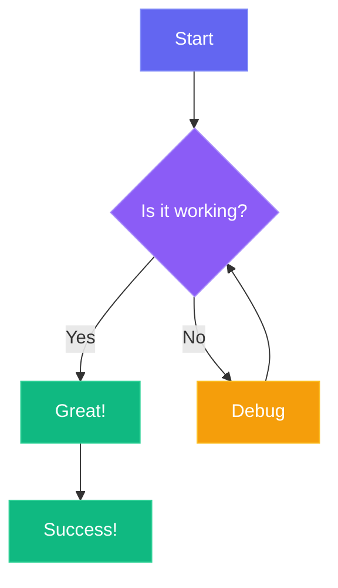
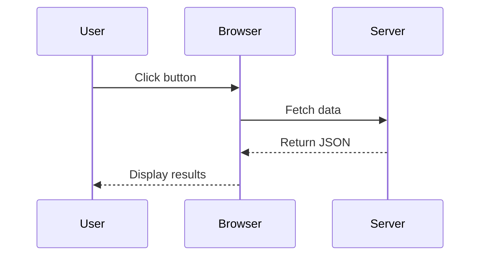
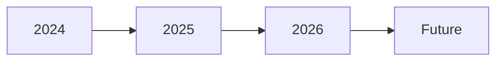

# Mermaid Diagram Test

This page tests the Mermaid.js integration with our Markdown system.

## Flowchart

## Sequence Diagram

## Simple Timeline

---

If you can see these diagrams rendered (not code blocks), Mermaid is working!
