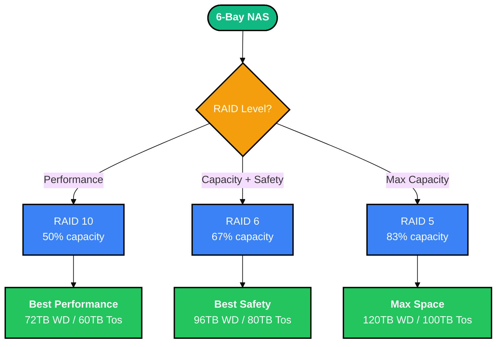

# NAS Hard Drive Research

**Project:** Zettlab D6 Ultra (6-bay NAS)  
**Use Case:** Plex media server + AI web applications  
**Location:** Canada  
**Current NAS:** Asustor AS5304T (30TB, full)  
**Date:** February 19, 2026

> [!NOTE]
> Hard drive prices are elevated due to AI hardware demand. This research aims to find the best value for a high-capacity NAS upgrade.

---

## Drive Options Comparison

### Price per TB Analysis

| Rank | Drive | Capacity | Price (CAD) | $/TB | Total for 6 |
|------|-------|----------|-------------|------|-------------|
| 🥇 | WD Red Pro | 24TB | $619.99 | **$25.83** | $3,719.94 |
| 🥈 | Toshiba N300 Pro | 20TB | $579.99 | $29.00 | $3,479.94 |
| 🥉 | Seagate IronWolf Pro | 28TB | $854.99 | $30.54 | $5,129.94 |
| 4 | WD Red Pro | 22TB | $674.99 | $30.68 | $4,049.94 |
| 5 | Seagate IronWolf Pro | 16TB | $489.99 | $30.62 | $2,939.94 |
| 6 | Toshiba N300 Pro | 18TB | $549.99 | $30.56 | $3,299.94 |
| 7 | Seagate IronWolf Pro | 24TB | $744.99 | $31.04 | $4,469.94 |
| 8 | Toshiba N300 Pro | 16TB | $499.98 | $31.25 | $2,999.88 |

---

## RAID Capacity Calculator

### How RAID Works

- **RAID 5:** 1 drive for parity (survives 1 drive failure)
- **RAID 6:** 2 drives for parity (survives 2 drive failures)
- **RAID 10:** Mirrored stripes (50% capacity, best performance)

### Usable Capacity (6 Drives)

| Drive | Raw Capacity | RAID 5 (5+1) | RAID 6 (4+2) | RAID 10 (3+3) |
|-------|--------------|--------------|--------------|---------------|
| **WD Red Pro 24TB** | 144TB | **120TB** | 96TB | 72TB |
| Toshiba N300 Pro 20TB | 120TB | 100TB | 80TB | 60TB |
| Seagate IronWolf Pro 28TB | 168TB | 140TB | 112TB | 84TB |
| WD Red Pro 22TB | 132TB | 110TB | 88TB | 66TB |
| Toshiba N300 Pro 18TB | 108TB | 90TB | 72TB | 54TB |
| Seagate IronWolf Pro 24TB | 144TB | 120TB | 96TB | 72TB |
| Seagate IronWolf Pro 16TB | 96TB | 80TB | 64TB | 48TB |
| Toshiba N300 Pro 16TB | 96TB | 80TB | 64TB | 48TB |

---

## Top Contenders

### 🥇 WD Red Pro 24TB - Best Value

**Price:** $619.99 CAD | **$/TB:** $25.83 | **Total for 6:** $3,719.94

**Specs:**
- 7200 RPM
- 512MB cache
- CMR (Conventional Magnetic Recording)
- 550 TBW (Terabytes Written)
- 5-year warranty
- Up to 24-bay NAS support
- 1M hours MTBF

**Pros:**
- Best $/TB ratio by ~12% margin
- 120TB usable (RAID 5) or 96TB (RAID 6)
- Enterprise-class reliability
- Optimized for RAID environments

**Cons:**
- Only available in Edmonton (3.5hr drive one way)
- Higher upfront cost than Toshiba 20TB

**Verdict:** Best value if you can get it. The 7-hour round trip is worth it for the capacity gain.

---

### 🥈 Toshiba N300 Pro 20TB - Best Alternative

**Price:** $579.99 CAD | **$/TB:** $29.00 | **Total for 6:** $3,479.94

**Specs:**
- 7200 RPM
- 256MB cache
- CMR
- Up to 24-bay support
- 300,000 load/unload cycles
- 1M hours MTBF

**Pros:**
- Locally available (no road trip)
- $240 cheaper upfront
- Still excellent NAS drive
- 100TB usable (RAID 5) or 80TB (RAID 6)

**Cons:**
- 20TB less capacity than WD 24TB option
- Slightly higher $/TB ratio

**Verdict:** Excellent choice if local convenience matters more than maximum capacity.

---

### 🥉 Seagate IronWolf Pro 28TB - Maximum Capacity

**Price:** $854.99 CAD | **$/TB:** $30.54 | **Total for 6:** $5,129.94

**Specs:**
- 7200 RPM
- 512MB cache
- CMR
- 5-year warranty
- Rescue data recovery services included

**Pros:**
- Maximum capacity: 140TB (RAID 5) or 112TB (RAID 6)
- Includes Seagate Rescue recovery
- Top-tier reliability

**Cons:**
- $1,410 more than WD 24TB
- Premium price for extra 20TB

**Verdict:** Only worth it if you absolutely need 140TB+ and budget isn't a concern.

---

## Decision Matrix

| Factor | WD 24TB | Toshiba 20TB | Seagate 28TB |
|--------|---------|--------------|--------------|
| **Best $/TB** | ✅ $25.83 | - | - |
| **Local pickup** | ❌ Edmonton only | ✅ Yes | Varies |
| **Max capacity** | - | - | ✅ 140TB |
| **Best value** | ✅ Winner | - | - |
| **Lowest cost** | - | ✅ $3,480 | - |
| **RAID 5 usable** | 120TB | 100TB | 140TB |
| **RAID 6 usable** | 96TB | 80TB | 112TB |

---

## The Math: Edmonton Trip Worth It?

```
WD 24TB (Edmonton):  $3,720 for 120TB usable (RAID 5)
Toshiba 20TB (local): $3,480 for 100TB usable (RAID 5)

Difference: $240 more for 20TB extra capacity
Effective price: $240 ÷ 20TB = $12/TB
```

> [!TIP]
> The extra 20TB from WD is effectively $12/TB - that's **half** the normal rate! If you need the space, the 7-hour drive is mathematically worth it.

**Decision framework:**
- **Need 100TB+?** → Drive to Edmonton for WD 24TB
- **Don't need 100TB?** → Toshiba 20TB locally, save $240 + gas + a day

---

## RAID Recommendation

### For Plex + AI Workloads



### My Recommendation: RAID 6

**Why RAID 6 for this use case:**

1. **Plex media is irreplaceable** - Re-ripping 100TB of movies/shows is a nightmare
2. **AI workloads can be recreated** - But why risk it?
3. **Drive failures correlate** - When one drive fails in a batch, others often follow
4. **Only costs 1 drive** - 96TB vs 120TB (WD) or 80TB vs 100TB (Toshiba)

> [!WARNING]
> With 6 drives, RAID 5 only protects against **single** drive failure. During rebuild, remaining drives are under maximum stress - this is when 2nd failures happen. RAID 6 is worth the capacity loss for peace of mind.

---

## Current vs Upgraded Capacity

| NAS | Drives | RAID | Usable | Status |
|-----|--------|------|--------|--------|
| Asustor AS5304T | 4× ? | ? | 30TB | 🟡 Full |
| Zettlab D6 Ultra (WD 24TB) | 6× 24TB | RAID 6 | **96TB** | 🟢 3.2× upgrade |
| Zettlab D6 Ultra (Toshiba 20TB) | 6× 20TB | RAID 6 | **80TB** | 🟢 2.7× upgrade |

---

## Drive Specs Comparison

### All Three Are Enterprise NAS Drives

| Spec | WD Red Pro | Toshiba N300 Pro | Seagate IronWolf Pro |
|------|------------|------------------|---------------------|
| RPM | 7200 | 7200 | 7200 |
| Cache | 512MB | 256MB | 512MB |
| Recording | CMR | CMR | CMR |
| MTBF | 1M hours | 1M hours | 1M hours |
| Warranty | 5 years | 5 years | 5 years |
| Max Bays | 24 | 24 | 24 |
| RV Sensors | Yes | Yes | Yes |
| Data Recovery | No | No | Yes (Rescue) |

**All three are solid choices.** You're not compromising on quality with any option.

---

## Action Items

- [ ] Decide: Edmonton trip worth it for WD 24TB?
- [ ] Confirm availability at Edmonton store
- [ ] Choose RAID level (recommend RAID 6)
- [ ] Order/buy drives
- [ ] Plan NAS migration from Asustor → Zettlab
- [ ] Set up Plex migration
- [ ] Configure AI app storage

---

## Notes

- All prices in CAD as of February 2026
- Prices elevated due to AI hardware demand
- WD 24TB availability limited to Edmonton store
- Consider future expansion: Zettlab supports 6 bays only

---

*Research compiled by Clawdbot AI Assistant*  
*Last updated: February 19, 2026*
