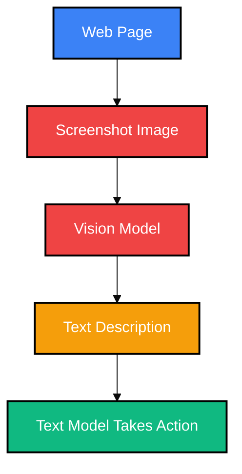
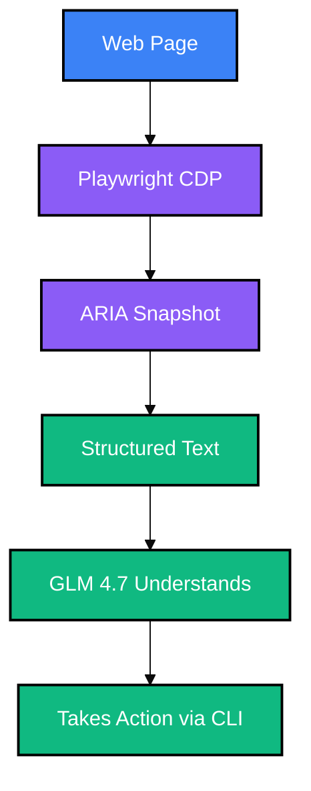

# OpenClaw Playwright CLI: Giving Text Models "Vision"

> [!TIP]
> **The Key Insight:** OpenClaw's Playwright CLI converts web pages into **structured text representations** (ARIA snapshots) that text-only models can understand and interact with—effectively giving models like GLM 4.7 "web vision" without requiring actual image processing capabilities.

---

## 🎯 The Problem: GLM 4.7's Limitation

**GLM 4.7** (the model powering this OpenClaw instance) is a powerful text model, but it has a significant limitation:

- ❌ **No native vision capabilities** - Cannot "see" images or screenshots
- ❌ **Cannot parse visual layouts** - Relies on text descriptions
- ❌ **Limited web interaction** - Cannot understand page structure visually

This means GLM 4.7 typically cannot:
- Fill out web forms
- Navigate complex interfaces
- Scrape dynamic content
- Interact with modern web applications

---

## 💡 The Solution: ARIA Snapshots

OpenClaw's Playwright CLI solves this through **ARIA (Accessible Rich Internet Applications) Snapshots**.

### What Are ARIA Snapshots?

ARIA snapshots are **text-based YAML representations** of a web page's accessibility tree. They capture:

- Page structure (headings, paragraphs, lists)
- Interactive elements (buttons, links, forms)
- Element roles and attributes
- Text content and labels
- Hierarchy and nesting

**Crucially:** This is all **structured text**, not images. Text-only models can parse, understand, and act on this data.

### Example ARIA Snapshot

Here's what GLM 4.7 "sees" when it looks at a page:

```yaml
- RootWebArea "Login Page"
  - none
    - none
      - heading "Welcome Back"
        - StaticText "Welcome Back"
      - text box "Username"
        - text box ""
      - text box "Password"
        - text box ""
      - button "Sign In"
      - link "Forgot Password?"
```

This text representation is **fully understandable** by GLM 4.7, enabling it to:
1. **Understand page structure** - Knows there's a login form
2. **Identify interactive elements** - Sees the username, password, and sign-in button
3. **Take action** - Can reference element refs to click, type, and interact

---

## 🚀 How It Works: The Workflow

### Traditional Vision-Based Approach (What GLM 4.7 CAN'T Do)



**Problem:** Requires vision model (GLM 4.7 doesn't have this)

### OpenClaw's Text-Based Approach (What GLM 4.7 CAN Do)



**Advantage:** Pure text pipeline—GLM 4.7 can understand and act on every step!

---

## 🛠️ Technical Implementation

### The OpenClaw Browser CLI

OpenClaw provides a comprehensive CLI for browser automation:

```bash
# Start isolated browser
openclaw browser --browser-profile openclaw start

# Open a webpage
openclaw browser open https://example.com/login

# Take ARIA snapshot (text-based)
openclaw browser snapshot --format aria

# Interact with elements (by ref from snapshot)
openclaw browser type 1 "myusername"
openclaw browser type 2 "mypassword"
openclaw browser click 3
```

### Key Commands for GLM 4.7

| Command | Purpose | Text-Based? |
|---------|---------|-------------|
| `snapshot --format aria` | Get page structure as text | ✅ Yes |
| `click <ref>` | Click element by reference | ✅ Yes |
| `type <ref> <text>` | Type into element | ✅ Yes |
| `wait --selector <css>` | Wait for element | ✅ Yes |
| `navigate <url>` | Go to URL | ✅ Yes |

---

## 📊 What GLM 4.7 Gains

| Capability | Without Playwright CLI | With Playwright CLI |
|------------|------------------------|---------------------|
| **Understand page structure** | ❌ No | ✅ Yes (via ARIA) |
| **Fill out forms** | ❌ No | ✅ Yes |
| **Navigate websites** | ❌ No | ✅ Yes |
| **Scrape data** | ⚠️ Limited | ✅ Yes (structured) |
| **Debug UI issues** | ❌ No | ✅ Yes |
| **Run automated tests** | ❌ No | ✅ Yes |

---

## 🔍 Is This Duplication of Existing Capabilities?

### What GLM 4.7 Already Has

- **Web search** - Built-in web_search tool
- **Fetch page content** - Built-in web_fetch tool
- **Process HTML** - Text-based parsing

### What Playwright CLI Adds

| New Capability | Why It Matters |
|----------------|----------------|
| **Interactive elements** | Can click, type, submit forms |
| **Dynamic content** | JavaScript-rendered pages |
| **Multi-step workflows** | Login → Navigate → Act → Logout |
| **Session management** | Maintain state across actions |

### 🎯 Verdict: **NOT Duplication**

- **Existing tools:** Read-only (fetch HTML, search web)
- **Playwright CLI:** Read-write (interact with pages)

> [!NOTE]
> **Analogy:** Existing tools are like reading a newspaper. Playwright CLI is like having hands that can turn pages, fill out crossword puzzles, and clip articles.

---

## 🎯 Use Cases for GLM 4.7 + Playwright CLI

### ✅ Perfect Use Cases

**1. Form Automation**
- Navigate to login page
- Understand form fields via ARIA
- Fill out username/password
- Click submit button
- Handle error messages

**2. Data Extraction**
- Navigate to product page
- Extract title, price, description
- Follow pagination links
- Scrape multiple pages
- Save structured data

**3. Testing & QA**
- Run user flows (login → checkout → logout)
- Verify page accessibility
- Check for broken links
- Test form validation

**4. Routine Tasks**
- Check email via web interface
- Submit forms (support tickets, surveys)
- Monitor dashboards for alerts
- Update CMS content

---

## 💡 Conclusion

OpenClaw's Playwright CLI **genuinely expands GLM 4.7's capabilities** by providing a text-based interface to web browsers.

**Key Takeaways:**

- ✅ **New capabilities** - Interactive web automation (not just reading)
- ✅ **Not duplication** - Adds read-write vs. existing read-only tools
- ✅ **Perfect fit for GLM 4.7** - Text-based pipeline aligns with model strengths
- ✅ **Real-world utility** - Forms, scraping, testing, automation
- ⚠️ **Not a replacement for vision** - Still needs vision model for images

**The Bottom Line:** For text-only models like GLM 4.7, Playwright CLI is a game-changer. It enables web interaction that would otherwise require switching to a vision-capable model.

---

## 📚 Resources

- **OpenClaw Browser Docs:** https://docs.openclaw.ai/tools/browser
- **OpenClaw CLI Reference:** https://docs.openclaw.ai/cli/browser
- **Playwright ARIA Snapshots:** https://playwright.dev/docs/aria-snapshots
- **Video:** [OpenClaw Browser CLI vs MCP](https://youtu.be/Be0ceKN81S8)

---

*Last Updated: February 10, 2026*
