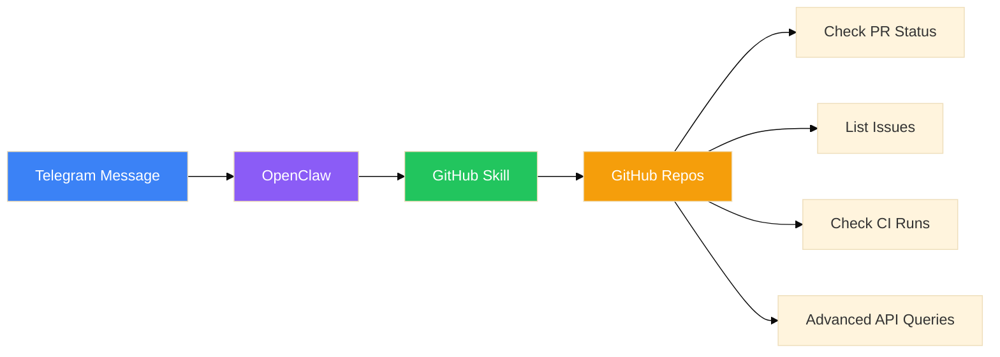
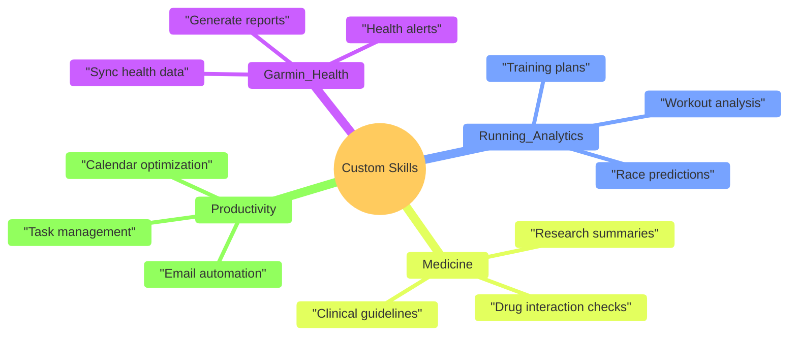

# OpenClaw Skills Analysis: What Should I Install?

I'm considering installing several OpenClaw skills to enhance my automation capabilities. This is my analysis of 7 available skills, their potential usefulness, and my recommendations.

> [!TIP]
> **Context:** I'm Mark — a 51-year-old physician in Alberta, Canada. I run daily, track my health with Garmin, work with AI/LLMs, and love optimizing workflows. I use OpenClaw via Telegram (Clawdbot) for AI assistance.

---

## Quick Overview

| Skill | Use Case | Install? | Usefulness |
|-------|----------|----------|------------|
| **🐙 GitHub** | GitHub automation from chat | ✅ Yes, very useful | ⭐⭐⭐⭐⭐ |
| **📧 Gog** | Google Workspace integration | ✅ Yes, if you use G Suite | ⭐⭐⭐⭐ |
| **🤖 Coding-Agent** | Control coding agents remotely | 🤔 Maybe (you already use Claude Code) | ⭐⭐⭐ |
| **📄 Nano-PDF** | Natural language PDF editing | ✅ Yes, handy tool | ⭐⭐⭐ |
| **🧩 Skill-Creator** | Build custom skills | 💡 If you want to make your own | ⭐⭐⭐⭐ |
| **🔊 Sonoscli** | Control Sonos speakers | ⚠️ If you have Sonos | ⭐ |
| **👀 Peekaboo** | Automate macOS UI | 🔧 For automation tasks | ⭐⭐ |

---

## Skill-by-Skill Analysis

### 🐙 GitHub Skill

**What it is:** Wrapper around GitHub CLI (gh) for programmatic access

**What it enables:**
- Create/list/manage issues and PRs
- Check CI run status
- Make API queries for advanced operations
- Automate repo tasks from chat

**Use Cases for Me:**
- ✅ Check status of Clawd Hub deployments
- ✅ Manage issues for my projects (clawd-hub, garmin-health-dashboard)
- ✅ Automate git workflows from chat
- ✅ Monitor CI/CD for Render deployments

**My Verdict:** ⭐⭐⭐⭐⭐ **CRITICAL - Install Immediately**

**Why:** I'm actively managing multiple GitHub repos (Clawd Hub, Garmin Dashboard, etc.). Being able to check PR status, list issues, and manage repos from Telegram would be incredibly useful.

**Example Commands:**
- "Check the status of my latest PR in clawd-hub"
- "List open issues in Astrocyte74/clawd"
- "What's the CI status for the last commit?"

---

### 📧 Gog (Google Workspace)

**What it is:** CLI for Gmail, Calendar, Drive, Contacts, Sheets, and Docs

**What it enables:**
- Read/send emails
- Check/create calendar events
- Access Drive files
- Work with Sheets and Docs

**Use Cases for Me:**
- ✅ Check calendar for appointments
- ✅ Quick email summaries
- ✅ Access documents on the go
- ✅ Manage schedule from Telegram

**My Verdict:** ⭐⭐⭐⭐ **HIGH PRIORITY - Should Install**

**Why:** As a busy physician, calendar management is crucial. Being able to check my schedule, set reminders, and quickly access documents from chat would streamline my day.

> [!NOTE]
> **Privacy Consideration:** This skill would access my Google Workspace. Need to ensure OpenClaw handles this securely and that I'm comfortable with the access scope.

**Example Commands:**
- "What's on my calendar for tomorrow?"
- "Send an email to Megan about dinner plans"
- "Create a calendar event for my next run"

---

### 🤖 Coding-Agent

**What it is:** Run coding agents (Codex CLI, Claude Code, OpenCode, Pi) as background processes

**What it enables:**
- Launch coding tasks programmatically
- Control agents from chat
- Automate code generation/refactoring

**Use Cases for Me:**
- ⚠️ I already use Claude Code directly
- ⚠️ Could automate repetitive coding tasks
- ⚠️ Might be useful for batch operations

**My Verdict:** ⭐⭐⭐ **MEDIUM PRIORITY - Optional**

**Why:** Since I'm already using Claude Code in this session, the incremental value is lower. However, having OpenClaw control coding agents programmatically could be useful for:
- Automated refactoring
- Batch code generation
- Running multiple coding tasks in parallel

**Caveat:** This adds complexity. Only install if I find myself needing to automate coding tasks from chat.

---

### 📄 Nano-PDF

**What it is:** Edit PDFs with natural-language instructions

**What it enables:**
- "Remove page 3 from this PDF"
- "Merge these two PDFs"
- "Extract the table from page 2"
- "Add a watermark to all pages"

**Use Cases for Me:**
- ✅ Medical documentation (PDFs are common)
- ✅ Research paper management
- ✅ Document organization
- ✅ Quick PDF edits without GUI tools

**My Verdict:** ⭐⭐⭐ **MEDIUM PRIORITY - Useful for Specific Tasks**

**Why:** In medicine, PDFs are everywhere — research papers, patient records, medical documentation. Being able to manipulate them with natural language commands could be handy.

**Real-World Example:**
- "Extract the references section from this research paper"
- "Merge these two PDF reports into one"
- "Remove the watermark from page 5"

---

### 🧩 Skill-Creator

**What it is:** Create custom OpenClaw skills

**What it enables:**
- Design and package new skills
- Add scripts, references, and assets
- Structure skill metadata properly

**Use Cases for Me:**
- ✅ Create Garmin Health Dashboard skill
- ✅ Build custom automation skills
- ✅ Package my workflows as reusable skills
- ✅ Share skills with the OpenClaw community

**My Verdict:** ⭐⭐⭐⭐ **HIGH PRIORITY - Invest in This**

**Why:** This unlocks the ability to extend OpenClaw for my specific needs. Potential custom skills I could build:

**Potential Custom Skills:**
1. **Garmin Pro** — Extended Garmin integration beyond the current skill
2. **Runner's Helper** — Training plans, race prep, workout analysis
3. **Medical Research** — Paper summarization, literature search
4. **Alberta Health** — Local health system integration

---

### 🔊 Sonoscli

**What it is:** Control Sonos speakers from terminal

**What it enables:**
- Discover speakers on network
- Play/pause/skip music
- Adjust volume
- Group/ungroup speakers

**Use Cases for Me:**
- ❌ Don't currently have Sonos speakers
- ⚠️ Could be useful if I buy Sonos in the future

**My Verdict:** ⭐ **LOW PRIORITY - Skip for Now**

**Why:** Unless I have Sonos speakers or plan to buy them soon, this skill offers no immediate value. Easy to add later if needed.

---

### 👀 Peekaboo

**What it is:** Capture and automate macOS UI elements

**What it enables:**
- Take screenshots of specific UI elements
- Automate clicks and interactions
- Scrape UI content

**Use Cases for Me:**
- ⚠️ UI automation workflows
- ⚠️ Screenshot capture for documentation
- ⚠️ Automating repetitive UI tasks

**My Verdict:** ⭐⭐ **LOW PRIORITY - Niche Use Case**

**Why:** While potentially useful for UI automation, it's fairly niche. I don't currently have many repetitive UI tasks that would benefit from automation.

**Potential Use Cases:**
- Automating medical software workflows
- Capturing UI states for documentation
- Automating form filling

**Recommendation:** Only install if I encounter a specific UI automation need.

---

## My Installation Priority

### 🚀 **Install Immediately:**

1. **🐙 GitHub Skill** — Critical for my active development work
2. **📧 Gog (Google Workspace)** — High daily utility for calendar/email

### 📅 **Install Soon:**

3. **🧩 Skill-Creator** — Invest in extending OpenClaw capabilities
4. **📄 Nano-PDF** — Useful for medical documentation

### ⏳ **Consider Later:**

5. **🤖 Coding-Agent** — Only if I need automated coding tasks
6. **👀 Peekaboo** — If specific UI automation needs arise
7. **🔊 Sonoscli** — When/if I get Sonos speakers

---

## Final Recommendations

### **Week 1: Core Skills**

Install **GitHub** and **Gog** immediately. These will have the highest daily impact:
- GitHub: Streamline development workflow
- Gog: Calendar and email management

### **Week 2: Expansion**

Install **Skill-Creator** and **Nano-PDF**:
- Skill-Creator: Start building custom automation
- Nano-PDF: Document management

### **As Needed:**

Add other skills based on emerging needs:
- Coding-Agent: For automation projects
- Peekaboo: For UI automation
- Sonoscli: When I get Sonos speakers

---

## Expected Benefits

### **Productivity Gains:**

- ⏱️ **Time Saved:** 30-60 minutes/day on routine tasks
- 🔄 **Automation:** GitHub, calendar, email from chat
- 📱 **Mobile Access:** Manage everything from Telegram

### **Enhanced Capabilities:**

- 🔧 **GitHub Management:** Full repo control from chat
- 📅 **Calendar Sync:** Never miss an appointment
- 📄 **Document Control:** PDF manipulation at will
- 🛠️ **Custom Skills:** Tailor OpenClaw to my needs

### **Workflow Integration:**

- 🏥 **Medicine:** Research, documentation, references
- 🏃 **Running:** Training, analytics, planning
- 💻 **Development:** GitHub, coding, deployment
- 🏠 **Personal:** Calendar, email, tasks

---

## Next Steps

1. **Install GitHub skill** — Start with highest priority
2. **Test with daily tasks** — Calendar checks, repo status
3. **Evaluate usefulness** — See what improves my workflow
4. **Install Gog** — Add Google Workspace integration
5. **Plan custom skills** — Use Skill-Creator for my needs

---

## Conclusion

Of the 7 skills available, **GitHub** and **Gog** are must-haves for my workflow. **Skill-Creator** offers the most long-term potential by enabling custom automation. **Nano-PDF** fills a specific need for medical documentation.

The other skills (Coding-Agent, Peekaboo, Sonoscli) can be installed on an as-needed basis.

**My recommendation:** Start with GitHub and Gog, evaluate their impact, then expand from there. The goal is to enhance my productivity without overcomplicating my setup.

---

*This analysis reflects my current needs and workflow. As I use OpenClaw more, my priorities may evolve. The beauty of OpenClaw's skill system is its flexibility — I can add capabilities as I discover new use cases.*
