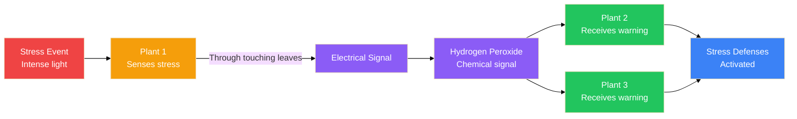
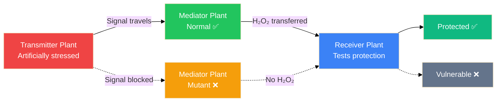
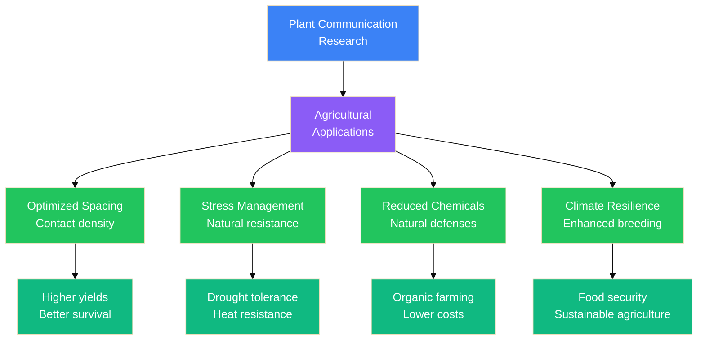

# Plants That Touch Each Other Are More Resilient to Stress

New research has uncovered a fascinating aspect of plant behavior: when plant leaves physically touch each other, they form a biological signaling network to warn each other about upcoming stress. This cooperative communication boosts their collective resilience to environmental challenges like intense light exposure.

> [!TIP]
> **Key Discovery:** Plants in physical contact transmit electrical and chemical signals that prepare connected plants for stress, reducing damage by up to 50% compared to isolated plants.

---

## The Science of Plant Communication

### How It Works

When plant leaves maintain physical contact, they create a communication network that functions like an early warning system:

**The Process:**

1. **Signal Transmission** — A stressed plant sends electrical signals through touching leaves
2. **Chemical Messaging** — Hydrogen peroxide is secreted as a key signaling molecule
3. **Network Activation** — All connected plants receive the warning and activate stress defenses
4. **Collective Resilience** — The entire plant group becomes more tolerant to upcoming stress

### The Experiment

Researchers at the University of Missouri used *Arabidopsis thaliana* (a small weed-like plant) to test whether touch itself enhances stress tolerance.

**Experimental Groups:**
- **Touching Group:** Plants arranged with leaf-to-leaf contact
- **Isolated Group:** Plants grown without physical contact
- **Stress Test:** Both groups exposed to intense bright light (harsh sunlight simulation)

**Measurements:**
- **Ion leakage** from leaves (indicates cellular damage)
- **Anthocyanin accumulation** (purple pigment = stress response)

## Key Findings

### Results: Touching vs. Isolated Plants

| Metric | Touching Plants | Isolated Plants | Difference |
|--------|-----------------|-----------------|------------|
| **Leaf Damage** | Low | High | ~50% less damage |
| **Anthocyanin** | Lower accumulation | Higher accumulation | Reduced stress response |
| **Resilience** | Enhanced | Reduced | Significant protection |

### The Hydrogen Peroxide Secret

To understand the mechanism, researchers created a clever experiment with a **three-plant chain**:

**The Setup:**
- **Transmitter:** Artificially stressed to send signals
- **Mediator:** Normal or mutant (cannot transfer chemical signals)
- **Receiver:** Measures protection level

**The Discovery:**
- ✅ **Normal mediator:** Receiver gets protection (H₂O₂ transferred)
- ❌ **Mutant mediator:** Receiver gets NO protection (signal blocked)

> [!TIP]
> **Key Insight:** Hydrogen peroxide (H₂O₂) secretion is the crucial chemical signal that boosts collective resilience. Without it, the communication network fails.

---

## Evolutionary Trade-off

This research reveals the cooperative side of plant behavior, challenging the view that plants only compete for resources.

> [!QUOTE]
> *"If you grow under harsh conditions, you better grow in a group. If you grow under ideal conditions with no predators, with no stressors, then you better grow individually."*
> — **Ron Mittler**, Phytologist, University of Missouri

### Adaptive Strategy

**Survival Strategy:**
- **Harsh environments:** Benefits of cooperation outweigh costs
- **Ideal environments:** Individual growth more efficient than group maintenance

---

## Why This Matters

### Agricultural Applications

Understanding plant communication networks could revolutionize farming practices:

**Potential Benefits:**

1. **Optimized Spacing** — Plant crops with appropriate contact density
2. **Stress Management** — Leverage natural signaling for drought/heat resistance
3. **Reduced Chemical Use** — Enhance natural defenses instead of pesticides
4. **Climate Resilience** — Breed varieties with enhanced communication abilities

### Ecological Insights

This research changes how we understand plant communities:

- **Forest Ecosystems** — Trees may coordinate stress responses across canopies
- **Prairie Grasslands** — Dense grass communities share stress warnings
- **Crop Monocultures** — Traditional spacing may disrupt natural networks

### Future Research Directions

- **Signal Identification** — Discover additional signaling molecules
- **Network Mapping** — Understand how far signals can travel
- **Genetic Enhancement** — Breed crops with improved communication
- **Cross-Species Signaling** — Test if different species can communicate

---

## The Research

### Study Details

| Aspect | Details |
|--------|---------|
| **Institution** | University of Missouri, Columbia |
| **Lead Researcher** | Ron Mittler (Phytologist) |
| **Plant Species** | *Arabidopsis thaliana* |
| **Stress Type** | Intense light exposure |
| **Signal Type** | Electrical + Chemical (hydrogen peroxide) |
| **Publication Status** | Preprint (not yet peer-reviewed) |
| **Preprint Server** | [BioRxiv](https://doi.org/10.1101/2025.09.02.673745) |

### Expert Opinion

> *"The authors propose a thoughtful and clever experimental design to better understand the still underexplored pathways of aboveground plant-to-plant communication. The design addresses a longstanding question: whether chemical signaling and electrical signaling are responsible for increased resilience to excessive light stress."*
> — **Piyush Jain**, Plant Biologist, Cornell University

---

## Frequently Asked Questions

**Q: Do all plants communicate through touch?**
A: Research suggests this is common in many plant species, but mechanisms may vary. This study focused on *Arabidopsis thaliana*, a model organism for plant research.

**Q: How far can signals travel between plants?**
A: Current research shows signals transmit through direct leaf-to-leaf contact. The extent of multi-hop networks is still being studied.

**Q: Can this apply to home gardening?**
A: Yes! Avoid over-spacing plants. Allow some leaf contact to enable natural stress communication networks.

**Q: Is this similar to the "wood wide web" (fungal networks)?**
A: Different mechanism. The wood wide web refers to underground mycorrhizal fungal networks. This is direct aboveground plant-to-plant communication.

**Q: When will this be peer-reviewed?**
A: The study is currently available on BioRxiv as a preprint. Peer review and journal publication are pending.

---

## References

- **Original Preprint:** [BioRxiv DOI: 10.1101/2025.09.02.673745](https://doi.org/10.1101/2025.09.02.673745)
- **Previous Study (2022):** Plant electrical signaling research
- **Source:** [New Atlas Article](https://newatlas.com/biology/plants-touch-communication-resilient-stress-signal/)

---

> [!NOTE]
> **Generated Images:** The illustrations on this page were created using the Z-Image API running locally via Tailscale, demonstrating private AI-powered content generation.

**Want to learn more about fascinating biological research?** Check out our other science articles on [Clawd Hub](/).
