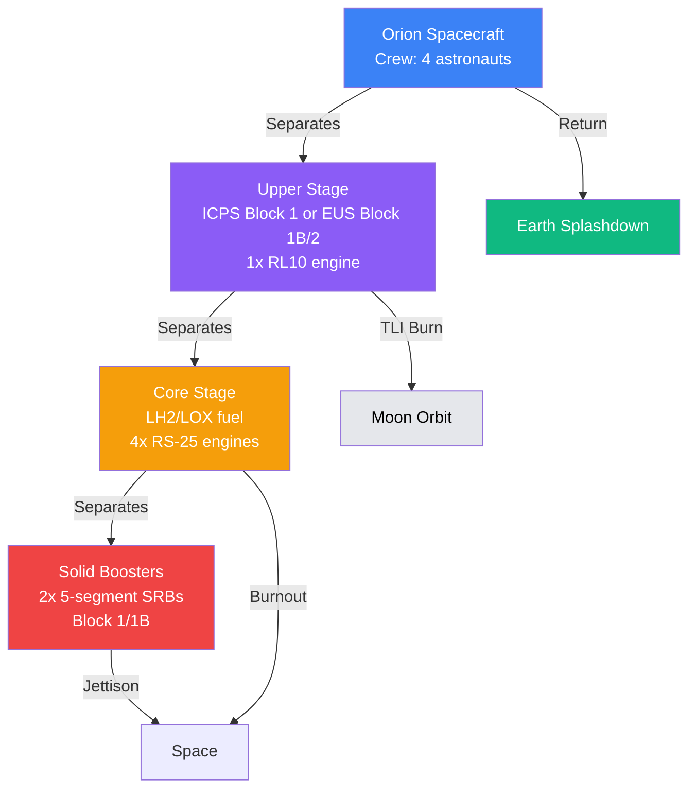
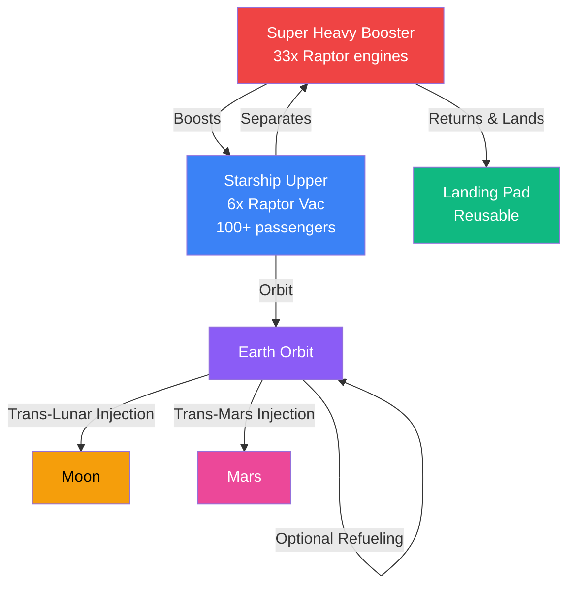
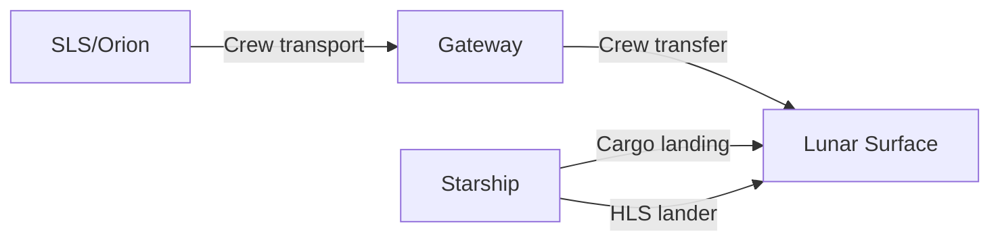

# SLS vs Starship: The Future of Space Exploration

A detailed comparison of two heavy-lift rockets that will shape humanity's return to the Moon and journey to Mars.

## Executive Summary

The **Space Launch System (SLS)** and **Starship** represent two fundamentally different approaches to space exploration. SLS is NASA's **government-developed, expendable super-heavy launch vehicle** designed for the Artemis program, while Starship is SpaceX's **fully reusable, privately-developed transportation system** aiming for rapid, cost-effective access to space.

> [!TIP]
> **Key Takeaway:** SLS offers proven heritage and near-term capability for Artemis, while Starship promises revolutionary cost reduction through reusability—if its ambitious development goals are achieved.

---

## Technical Specifications Comparison

| Specification | SLS Block 1 | SLS Block 1B | SLS Block 2 | Starship (V2) |
|--------------|-------------|-------------|-------------|---------------|
| **Height** | 98 m (322 ft) | 111 m (365 ft) | 111 m (365 ft) | 121 m (397 ft) |
| **Diameter** | 8.4 m (27.6 ft) | 8.4 m (27.6 ft) | 8.4 m (27.6 ft) | 9 m (30 ft) |
| **Mass (liftoff)** | 2,610 t | ~2,750 t | ~2,900 t | ~5,000 t |
| **Thrust (liftoff)** | 39 MN (8.8M lbf) | 40 MN (8.9M lbf) | 42 MN (9.5M lbf) | ~74 MN (16.7M lbf) |
| **Payload to LEO** | 95 t | 105 t | 130 t | 150-250 t (projected) |
| **Payload to TLI** | >27 t | 42 t | >46 t | 100-150 t (projected) |
| **Reusability** | ❌ Expendable | ❌ Expendable | ❌ Expendable | ✅ Fully reusable |
| **First Flight** | November 2022 | ~2028 (planned) | ~2030 (planned) | Development ongoing |

**TLI = Trans-Lunar Injection** — the delta-v needed to reach the Moon

---

## Cost Analysis: The Defining Difference

### Development and Per-Launch Costs

| Cost Metric | SLS | Starship |
|-------------|-----|----------|
| **Development Cost** | $31.6+ billion (2011-2025) | ~$5-10 billion (estimated) |
| **Cost Per Launch** | $2.5-4 billion | <$10 million (goal) |
| **Annual Operating Cost** | $2.6 billion (FY23) | Not public |
| **Production Rate** | ~1 rocket/year | Rapid, mass production |

> [!WARNING]
> **Critical Cost Reality:** A single SLS launch costs more than **250 Starship launches** (at SpaceX's target cost). This fundamental difference shapes every aspect of exploration architecture.

### Why SLS Is So Expensive

**Congressional Mandates:**
- Required use of Space Shuttle components (RS-25 engines, solid boosters)
- Spread work across multiple states for political support
- Cost-plus contracting with Boeing, Northrop Grumman, Aerojet Rocketdyne

**Legacy Technology:**
- Expendable design — every rocket is flown once
- Complex assembly using refurbished Shuttle hardware
- Low production rate = high per-unit costs

**Political Constraints:**
- Job preservation in key districts
- No competitive bidding for core contracts
- Sustaining engineering costs for low flight rate

---

## Architecture Comparison

### SLS: Apollo-Style Architecture

**Key Characteristics:**
- **Staged combustion** — boosters and core stage drop off
- **Hydrogen fuel** — high efficiency, complex handling
- **Proven systems** — derived from Space Shuttle
- **One-time use** — all components discarded after launch

### Starship: Fully Reusable System

**Key Characteristics:**
- **Full reusability** — both stages return for reuse
- **Methane fuel** — easier to produce on Mars
- **Rapid reuse** — goal of hours between flights
- **Mass production** — dozens of vehicles manufactured in parallel

---

## Lunar Mission Profiles

### SLS/Orion: Artemis Program

**Artemis III Mission (2026+):**
1. **Launch** — SLS Block 1 launches Orion + HLS lander
2. **Trans-lunar injection** — ICPS upper stage sends Orion to Moon
3. **Lunar orbit** — Orion docks with Starship HLS lander
4. **Descent** — Crew transfers to Starship HLS for landing
5. **Surface ops** — ~6 days on lunar surface
6. **Ascent** - Starship HLS returns crew to Orion
7. **Return** — Orion carries crew back to Earth

**Advantages:**
- ✅ **Proven Orion spacecraft** — life support, heat shield tested
- ✅ **Launch escape system** — crew safety during ascent
- ✅ **Near-term capability** — Artemis I successfully flew

**Limitations:**
- ❌ **Dependent on Starship HLS** — NASA needs SpaceX for landing anyway
- ❌ **Low flight rate** — 1-2 missions per year maximum
- ❌ **Small crew** — 4 astronauts vs. Starship's 100+ capacity

### Starship: Direct Architecture

**Starship Lunar Mission:**
1. **Launch** — Super Heavy boosts Starship to orbit
2. **Refuel** — 6-8 tanker Starships refuel lander in orbit
3. **TLI burn** — Starship departs for Moon
4. **Landing** — Vertical landing on lunar surface
5. **Surface ops** — 100+ ton payload, 100+ people
6. **Return** — Starship launches directly from Moon

**Advantages:**
- ✅ **Massive payload** — 100+ tons to lunar surface
- ✅ **Large crew capacity** — 100+ astronauts per mission
- ✅ **No Orion needed** — Starship does entire mission
- ✅ **Rapid cadence** — Multiple missions per month possible

**Challenges:**
- ⚠️ **In-flight refueling** — Never demonstrated at scale
- ⚠️ **Crew safety** — No launch escape system (yet)
- ⚠️ **Lunar landing** — Precision landing on unprepared terrain

---

## Mars Mission Implications

### SLS for Mars: Limited Role

**Reality Check:** SLS is **not designed for Mars missions**. The architecture is fundamentally limited:

| Limitation | Impact on Mars |
|------------|----------------|
| **Expendable** | Every mission needs new rockets — unsustainable |
| **Low payload to TMI** | Block 2: ~46 t to TLI, less to Mars |
| **Low flight rate** | 1-2 missions/year — insufficient for Mars colony |
| **Small Orion** | 4-person crew, minimal cargo capacity |

**Trans-Mars Injection (TMI) Requires:**
- ~30-40 t for crewed mission (minimal)
- ~100-200 t for cargo missions (impossible for SLS)
- Multiple launches + in-orbit assembly (complex, expensive)

> [!NOTE]
> **NASA's Current Mars Plans:** NASA recognizes SLS limitations. The agency is studying **Starship as the primary Mars transport** while SLS focuses on lunar missions and Gateway logistics.

### Starship for Mars: Designed From the Start

**Mars Architecture:**
1. **Earth orbit refuel** — 6-8 tankers fill Starship
2. **TMI burn** — Depart Earth for Mars
3. **Entry, descent, landing** — Propulsive landing (no parachutes needed due to thin atmosphere)
4. **ISRU fuel production** — Sabatier process creates methane + LOX from Martian CO₂ and H₂O
5. **Return mission** — Refuel on Mars, fly back to Earth

**Key Enabling Technologies:**
- ✅ **In-situ resource utilization (ISRU)** — Make fuel on Mars
- ✅ **Raptor engines** — Full-flow staged combustion, methane fuel
- ✅ **Stainless steel** — Cheap, repairable, cryogenic-compatible
- ✅ **Heat shield tiles** — Replaceable, ablatable for atmospheric entry

**Mars Mission Estimates:**
- **Payload to Mars:** 100-150 tons per mission
- **Crew capacity:** 100+ people per Starship
- **Launch window:** Every 26 months (Mars synodic period)
- **Cost goal:** <$10M per mission (vs. $20B+ for traditional approaches)

---

## Development Status & Timeline

### SLS: Operational, But Expensive

| Milestone | Date | Status |
|-----------|------|--------|
| **Artemis I** | November 2022 | ✅ Successful uncrewed lunar orbit |
| **Artemis II** | April 2026 (planned) | 🔄 Crewed lunar flyby |
| **Artemis III** | 2027+ (planned) | 🔄 Human lunar landing |
| **Artemis IV** | 2028+ (planned) | 🔄 First Block 1B flight |
| **Block 2** | 2030+ (planned) | 📋 Enhanced boosters |

**Challenges:**
- 📈 **Cost overruns** — $31.6B spent by 2025 (140% over budget)
- ⏱️ **Schedule delays** — 6 years late for first flight
- 🏛️ **Political vulnerability** — Trump 2025 budget proposes cancellation after Artemis III

### Starship: Rapid Iteration, Increasing Capability

| Milestone | Date | Status |
|-----------|------|--------|
| **Starship hop tests** | 2020-2021 | ✅ Successful |
| **IFR flights** | 2021-2023 | ✅ 8 flights, increasing success |
| **Orbital test** | 2023+ | 🔄 Ongoing development |
| **Orbital refueling demo** | 2024-2025 | 🔄 Planned |
| **HLS uncrewed landing** | 2025+ | 📋 Artemis III precursor |
| **HLS crew landing** | 2027+ | 📋 Artemis III |

**Development Philosophy:**
- 🚀 **Rapid iteration** — Build, test, fail, learn, repeat
- 💰 **Private funding** — SpaceX's own capital + NASA contracts
- 🎯 **Mars-first design** — Everything optimized for Mars colonization

---

## Comparative Analysis: Pros & Cons

### SLS Advantages

| Pro | Explanation |
|-----|-------------|
| **Proven heritage** | Uses flight-tested Space Shuttle components |
| **Political backing** | Congressional mandate ensures funding (for now) |
| **Crew safety focus** | Orion has launch escape system, extensive safety reviews |
| **Near-term capability** | Already flown successfully; Artemis II/III imminent |
| **Deep space experience** | NASA's decades of human spaceflight expertise |

### SLS Disadvantages

| Con | Explanation |
|-----|-------------|
| **Extreme cost** | $2.5-4B per launch — unsustainable for Mars |
| **Expendable design** | Every rocket discarded — no reusability |
| **Low flight rate** | 1-2 launches/year max — insufficient for colony |
| **Political dependency** | Subject to changing administrations, budgets |
| **Limited payload** | Max 130 t to LEO — constraints on mission architecture |

### Starship Advantages

| Pro | Explanation |
|-----|-------------|
| **Radically lower cost** | <$10M per launch goal — 1000x cheaper than SLS |
| **Full reusability** | Both stages recovered — aircraft-like operations |
| **Massive payload** | 150-250 t to LEO — enables Mars colony logistics |
| **Rapid iteration** — Private development — faster progress |
| **Mars optimization** | ISRU-compatible fuel, in-situ resource utilization |

### Starship Disadvantages

| Con | Explanation |
|-----|-------------|
| **Unproven technology** | Orbital refueling, rapid reuse never demonstrated |
| **No crew escape system** — Loss of crew probability higher (initially) |
| **Development risk** | Ambitious goals — technical challenges remain |
| **Regulatory hurdles** — FAA licenses, environmental reviews |
| **Funding uncertainty** — Private capital depends on market success |

---

## The Future: Coexistence or Competition?

### Near-Term (2025-2030): **Coexistence**

**Likely Outcome:** Both systems serve complementary roles

**Artemis Program Division:**
- **SLS/Orion** → Crew transport to lunar orbit
- **Starship HLS** → Lunar lander (both crew + cargo)
- **Commercial partners** → Gateway logistics, science missions

### Long-Term (2030+): **Starship Dominance**

**Inevitable Transition:** Economics and capability favor Starship

| Scenario | SLS Role | Starship Role |
|----------|----------|---------------|
| **Lunar exploration** | Crew transport to orbit | Surface lander, logistics, base |
| **Mars colonization** | Minimal (science missions?) | Primary transport system |
| **LEO operations** | Limited (government payloads?) | Massive space infrastructure |
| **Cost per kg to Mars** | >$100,000/kg | <$1,000/kg (goal) |

> [!TIP]
> **Historical Parallel:** Just as airlines replaced ocean liners for trans-Atlantic travel due to cost and frequency, Starship's reusability will likely replace expendable rockets for interplanetary transportation.

---

## Conclusion: Two Paths Forward

### The Conservative Path: SLS

**Best For:**
- Near-term human lunar missions
- Proven, safety-critical crew transport
- Government-led exploration programs
- Missions where political stability matters

**Fundamental Constraint:**
- **Cannot scale to Mars** — economics and flight rate prohibit colony development

### The Revolutionary Path: Starship

**Best For:**
- Large-scale lunar surface operations
- Mars colonization and settlement
- Cost-sensitive commercial applications
- High-frequency space logistics

**Fundamental Risk:**
- **Unproven at scale** — orbital refueling, rapid reuse must work

### The Reality

**Both will likely fly for the next decade**, but the **long-term winner is clear**: economics, reusability, and capability all favor Starship. SLS may become a specialized crew transport vehicle (like a spacecraft equivalent of Air Force One), while Starship becomes the "workhorse" for heavy cargo and bulk passenger transport.

**The critical question:** Can SpaceX achieve rapid, reliable, safe operations at scale? If yes, the solar system opens. If not, we fall back to the slower, more expensive SLS model — and Mars remains a distant dream.

---

## Sources & Further Reading

- [NASA SLS Fact Sheet](https://www.nasa.gov/humans-in-space/space-launch-system/)
- [SpaceX Starship Updates](https://www.spacex.com/vehicles/starship/)
- [GAO SLS Cost Audits](https://www.gao.gov/products/gao-23-105609)
- [NASA Artemis Program Overview](https://www.nasa.gov/artemis/)
- [Congressional Research Service: SLS vs. Commercial Options](https://crsreports.congress.gov/product/pdf/IF/IF12345)

---

*Generated by Clawdbot AI Assistant • February 7, 2026*
